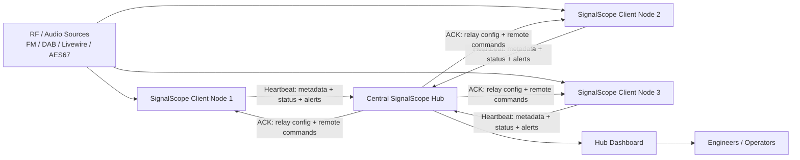

# SignalScope

SignalScope is a **web-based radio monitoring and signal analysis platform** designed for broadcast engineers and SDR enthusiasts.

It ingests **FM, DAB and Livewire/AES67 audio streams**, analyses them in real time, and presents results in a modern web dashboard. The system supports both **stand-alone monitoring nodes and distributed hub deployments** for network-wide signal monitoring.

SignalScope is written in **Python (Flask)** and designed to run on **Linux servers, VMs, and small systems like Raspberry Pi**.

---

## Quick Install

```bash
/bin/bash <(curl -fsSL https://raw.githubusercontent.com/itconor/SignalScope/main/install_signalscope.sh)
```

Or clone and run the installer:

```bash
git clone https://github.com/itconor/SignalScope.git
cd SignalScope
bash install_signalscope.sh
```

If you prefer to inspect the script first:

```bash
curl -O https://raw.githubusercontent.com/itconor/SignalScope/main/install_signalscope.sh
bash install_signalscope.sh
```

The installer will:

- Detect existing installations and offer to update in-place
- Install system dependencies (including `rtl-sdr`, `welle.io`, `libportaudio2`)
- Create the Python virtual environment and install required packages
- Configure the systemd service and self-healing watchdog
- Optionally configure NGINX as a reverse proxy with Let's Encrypt TLS
- Start SignalScope

Once complete, open `http://localhost:5000`. The setup wizard will guide you through the rest.

### Windows

A PowerShell installer (`install_signalscope_windows.ps1`) is included for Windows installations using a venv and scheduled task.

---

## Features Overview

| Category | What SignalScope does |
|---|---|
| **Inputs** | FM via RTL-SDR, DAB via RTL-SDR, Livewire/AES67 (RTP multicast), HTTP/HTTPS audio streams, local ALSA/PulseAudio devices |
| **FM Scanner** | On-demand FM frequency tuning via RTL-SDR with live browser audio, RDS decoding, band scan, tuning history and presets; hub scanner page (`/hub/scanner`) |
| **Web SDR plugin** | Browser-based SDR with scrolling waterfall, click-to-tune, WFM/NFM/AM demodulation — installed via Settings → Plugins |
| **Logger plugin** | Continuous 24/7 compliance recording of any monitored stream; 5-minute segments with silence overlay, scrubable timeline, mark in/out clip export, per-stream quality tiers and configurable retention — installed via Settings → Plugins |
| **Level & loudness** | dBFS level, LUFS Momentary/Short-term/Integrated (EBU R128), true peak |
| **Metadata** | RDS PS name, RDS RadioText, stereo flag, TP/TA/PI; DAB service name, DLS now-playing text, ensemble/mode/bitrate/SNR |
| **Rule alerts** | Silence, clipping, hiss, LUFS true peak, LUFS integrated loudness |
| **Composite fault alerts** | STUDIO_FAULT, STL_FAULT, TX_DOWN (FM); DAB_AUDIO_FAULT, DAB_SERVICE_MISSING (DAB); RTP_FAULT (Livewire/AES67) |
| **Name mismatch alerts** | FM_RDS_MISMATCH, DAB_SERVICE_MISMATCH |
| **AI anomaly detection** | Per-stream ONNX autoencoder, 24 h learning phase, adaptive baseline, feedback-driven retraining (👍/👎 in Reports or Hub Reports) |
| **Broadcast Chains** | Visual signal path builder with fault location, node stacking, ad break handling, maintenance bypass, flap detection, chain health score, chain SLA, fault history with audio replay timeline, all-node clip capture, predictive level trend, shared fault detection, historical time-travel view |
| **Stream comparator** | Cross-correlate pre/post processing pairs; detect processor failure, gain drift, dropout |
| **Metric history** | SQLite time-series, 90-day retention, signal history charts (15+ metrics), availability timeline, trend analysis |
| **Notifications** | Email (SMTP), MS Teams Adaptive Cards, Pushover, plain text webhooks, alert escalation |
| **Hub mode** | Multi-site aggregation, site approval, remote source management, wall mode, hub reports |
| **PTP monitoring** | Offset, jitter, drift, grandmaster change detection; values logged to metric history |
| **SLA tracking** | Monthly per-stream uptime percentage; chain SLA tracking |
| **Plugin system** | Drop-in `.py` plugins extend the UI with new pages and routes; install from the built-in plugin registry in Settings |
| **Security** | CSRF, PBKDF2-SHA256 passwords, HMAC+AES-256-GCM hub comms, session timeouts, rate limiting |
| **Backup & restore** | One-click ZIP backup of config, AI models, signal history DB, SLA data, alert log and hub state |

---

## Getting Started

### First Run

After installation, open `http://localhost:5000`. The setup wizard walks through:

1. **Authentication setup** — set an admin password
2. **SDR configuration** — detect and configure RTL-SDR dongles if present
3. **Hub configuration** — optionally configure this node as a hub client or hub server
4. **Monitoring settings** — silence threshold, alert cooldown, notification channels

After the wizard completes, the dashboard loads automatically.

### Adding Your First Input

1. Go to **Settings → Inputs** and click **+ Add Input**
2. Choose a source type, enter a name and device address (see the Inputs section below)
3. Save — monitoring starts within a few seconds

### Dashboard Overview

The dashboard shows a card for each monitored stream. Each card displays:

- Live level bar and dBFS reading
- LUFS Momentary/Short-term/Integrated values
- RDS Programme Service name and RadioText (FM), or DAB service name and DLS text (DAB)
- AI status badge (Learning / OK / Anomaly)
- Trend badge when level is notably above or below the expected range
- 24-hour availability timeline bar
- Alert/warning status strip on the card border
- Listen button for live audio in the browser — opens a sticky mini-player bar at the bottom of the page

Cards are drag-to-reorder. Alert cards sort to the top automatically.

---

## Inputs

### Source Types and Device Address Formats

| Source type | Address format | Example |
|---|---|---|
| FM via RTL-SDR | `fm://<frequency_MHz>` | `fm://96.3` |
| FM with specific dongle | `fm://<freq>?serial=<serial>&ppm=<offset>` | `fm://96.3?serial=00000001&ppm=-2` |
| DAB service | `dab://<ServiceName>?channel=<CH>` | `dab://Cool FM?channel=12D` |
| Livewire (multicast RTP) | `rtp://<multicast_address>:<port>` | `rtp://239.192.10.1:5004` |
| AES67 (RTP) | `rtp://<multicast_address>:<port>` | `rtp://239.69.0.1:5004` |
| HTTP/HTTPS audio stream | Full URL | `http://relay.example.com:8000/stream` |
| Local sound device | `sound://<device_index>` | `sound://2` |

### SDR Dongle Assignment

RTL-SDR dongles are configured in **Settings → SDR Devices**. Each dongle has a **Role**:

| Role | Use |
|---|---|
| `FM` | FM monitoring inputs |
| `DAB` | DAB monitoring inputs |
| `Scanner` | FM Scanner and Web SDR — exclusively reserved for on-demand tuning |
| `None` | Unassigned / general use |

Before adding FM or DAB inputs, assign the appropriate role to each dongle. The dongle dropdown on the Add Input form only shows compatible roles.

Dongles marked **Scanner** are reported to the hub in every heartbeat and used to populate the site selector on the FM Scanner and Web SDR pages. Only sites with at least one Scanner dongle will appear in those selectors.

### Adding FM Sources

1. In the Add Input form, select **FM**
2. Enter the frequency in MHz as the device address
3. Select the RTL-SDR dongle to use from the **Dongle** dropdown (register dongles in Settings → SDR Devices first)
4. Optionally set a PPM calibration offset
5. Save — SignalScope starts the RTL-SDR receiver and will begin reporting level, carrier strength, and RDS data

### Adding DAB Sources

1. Select **DAB** in the Add Input form
2. Select a DAB channel (e.g. `12D`) and click **🔍 Scan Mux** to enumerate all services on that multiplex
3. Select one or more services from the list and click **➕ Add Selected Services**
4. Each service is added with its broadcast name and the correct `dab://` address automatically

Multiple DAB services on the same multiplex share a single `welle-cli` process, started with elevated scheduling priority (`nice -10`) to maintain stability on ARM hardware.

### Adding Livewire / AES67 Sources

Enter the multicast RTP address and port as the device address. SignalScope joins the multicast group and measures RTP packet loss and jitter (RFC 3550 EWMA) in addition to audio levels.

### Adding Local Sound Devices

Select **Local Sound Device** — a drop-down is populated from the OS device list via `/api/sound_devices`. Select a device (microphone, line-in, USB audio, loopback) and save. The device index is stored as `sound://<index>`.

---

## FM Scanner

The FM Scanner (`/hub/scanner`) lets you tune any FM frequency on demand and listen to live audio in the browser — without permanently adding the frequency as a monitored input.

Requires at least one RTL-SDR dongle configured with role **Scanner** in **Settings → SDR Devices**. Only sites with a Scanner dongle appear in the site selector.

### Using the FM Scanner

1. On the Hub page, click **🔍 Scanner** (or navigate to `/hub/scanner`)
2. Select a site from the site dropdown
3. Enter an FM frequency in MHz and click **▶ Start** — audio begins streaming after a brief start-up delay
4. While streaming, type a new frequency and click **Tune** to retune without restarting

### Features

- **Live RDS** — Programme Service name, RadioText, stereo flag, TP/TA/PI decoded in real time
- **Tuning history** — recently tuned frequencies listed below the frequency field; click any entry to retune
- **Presets** — save frequently used frequencies; click to tune from any state (streaming or idle)
- **Band scan** — click **📡 Scan Band** to run a power sweep across the FM band and display strong stations as clickable peaks; the scan requires the dongle to be free (not streaming)
- **Click-to-tune** — clicking a history item, preset, or scan result peak while idle starts a new stream on that frequency; clicking while already streaming retunes immediately

### Audio Pipeline

The pipeline runs entirely in Python: `rtl_fm → resampling (scipy) → PCM → hub relay → browser Web Audio API`. End-to-end latency is typically 1–2 seconds RF to browser.

For WAN deployments where the hub is hosted remotely from the SDR client, the pipeline uses adaptive chunk batching to maintain real-time throughput regardless of round-trip time.

---

## Logger Plugin

The Logger plugin (`logger.py`) provides continuous 24/7 compliance recording for any monitored stream, with a visual timeline browser and clip export

Install it from **Settings → Plugins → Check GitHub for plugins**.

### Recording

Each stream you enable is recorded continuously as 5-minute clock-aligned MP3 segments stored under `logger_recordings/{stream}/{YYYY-MM-DD}/HH-MM.mp3`. Recordings start as soon as the plugin is saved — no restart required.

Silence is detected inline using ffmpeg's `silencedetect` filter and stored per-segment in a local SQLite index.

### Timeline

The **Timeline** tab shows a 24-hour grid of 288 colour-coded blocks for any stream and date:

| Colour | Meaning |
|---|---|
| 🟢 Green | Segment recorded, audio present throughout |
| 🟡 Amber | Segment recorded, partial silence detected |
| 🔴 Red | Segment recorded, mostly or completely silent |
| ⬛ Dark | No recording for this time slot |

Click any block to load and play that 5-minute segment in the player bar.

### Playback & Clip Export

The player bar at the bottom provides:

- **Scrub bar** — click or drag to seek within the loaded segment
- **Mark In / Mark Out** — set clip boundaries at any point while playing
- **Export Clip** — extracts the marked range using ffmpeg and downloads it as a named MP3; ranges can span multiple consecutive segments (up to 2 hours)

### Quality Tiers & Retention

Configure per-stream in the **Settings** tab:

| Setting | Default | Description |
|---|---|---|
| HQ Bitrate | 128k | Bitrate for new recordings |
| LQ Bitrate | 48k | Bitrate after quality downgrade |
| LQ after (days) | 30 | Re-encode to LQ after this many days |
| Delete after (days) | 90 | Purge recordings after this many days |

A background thread runs hourly, re-encoding older segments to the LQ bitrate and deleting segments beyond the retention period.

---

## Plugin System

SignalScope supports drop-in plugins. Any `.py` file placed alongside `signalscope.py` that contains the string `SIGNALSCOPE_PLUGIN` is loaded automatically at startup and can register new Flask routes and nav bar items.

### Installing Plugins

Go to **Settings → Plugins** to:

- View installed plugins and their active/restart-needed status
- Browse the official plugin registry on GitHub
- Install plugins with one click — the file is downloaded, validated, and saved to the SignalScope directory
- Remove plugins — the file is deleted; a restart completes the unload

A restart is required to activate or fully unload a plugin after installing or removing.

### Web SDR Plugin

The **Web SDR** plugin (`sdr.py`) adds a browser-based software defined radio at `/hub/sdr`:

- Scrolling waterfall display with colour-coded signal intensity
- Click anywhere on the waterfall to tune to that frequency
- Demodulation modes: WFM, NFM, AM
- Live audio streamed to the browser using the same relay infrastructure as the FM Scanner
- Requires a dongle configured with role **Scanner**

Install it from **Settings → Plugins → Check GitHub for plugins**.

### Logger Plugin

The **Logger** plugin (`logger.py`) provides 24/7 compliance recording at `/hub/logger`. See the [Logger Plugin](#logger-plugin) section above for full documentation.

Install it from **Settings → Plugins → Check GitHub for plugins**.

### Writing a Plugin

Drop a `.py` file alongside `signalscope.py`:

```python
SIGNALSCOPE_PLUGIN = {
    "id":    "myplugin",
    "label": "My Plugin",
    "url":   "/hub/myplugin",
    "icon":  "🔧",
}

def register(app, ctx):
    login_required = ctx["login_required"]
    monitor        = ctx["monitor"]

    @app.get("/hub/myplugin")
    @login_required
    def myplugin_page():
        return "<h1>My Plugin</h1>"
```

See `CLAUDE.md` in the repository for full plugin authoring documentation including audio relay integration, hub↔client command patterns, SDR IQ capture recipes, and the browser audio pump JS.

---

## Alerting

### Alert Types

**Level alerts** (apply to all source types):

| Alert | Condition |
|---|---|
| `SILENCE` | Audio level falls below the configured silence floor |
| `CLIP` | Audio level reaches or exceeds the clip threshold (default −1.0 dBFS) |
| `HISS` | High-frequency noise floor detected above threshold |
| `LUFS_TP` | True peak exceeds configured dBTP threshold (default −1.0 dBTP) |
| `LUFS_I` | 30-second integrated loudness deviates from EBU R128 target (default −23 LUFS ± 3 LU) |

**Composite fault alerts** (silence is diagnosed automatically):

| Alert | Source | What it means |
|---|---|---|
| `STUDIO_FAULT` | FM | Silence + carrier present + RDS present → playout/studio failure |
| `STL_FAULT` | FM | Silence + carrier present + RDS absent → STL/link failure |
| `TX_DOWN` | FM | Silence + weak/no carrier + no RDS → transmitter or RF failure |
| `DAB_AUDIO_FAULT` | DAB | Silence + mux locked + SNR ≥ 5 dB → studio/playout fault |
| `DAB_SERVICE_MISSING` | DAB | Ensemble locked but configured service absent from mux |
| `RTP_FAULT` | Livewire/AES67 | Silence + ≥ 10% packet loss → network fault |

**Metadata mismatch alerts**:

| Alert | Condition |
|---|---|
| `FM_RDS_MISMATCH` | Received RDS PS name differs from configured expected name, or changes unexpectedly |
| `DAB_SERVICE_MISMATCH` | Received DAB service name differs from configured expected name, or changes unexpectedly |

**AI and chain alerts**:

| Alert | Condition |
|---|---|
| `AI_ANOMALY` | AI autoencoder reconstruction error exceeds learned threshold |
| `CMP_ALERT` | Post-processing stream silent while pre-processing stream has audio |
| `CHAIN_FAULT` | First down node identified in a broadcast chain |
| `CHAIN_RECOVERED` | Previously faulted chain returns to fully OK |
| `CHAIN_FLAPPING` | Chain has faulted and recovered 3+ times within 10 minutes |

### Setting Expected RDS / DAB Names

On any FM stream card, click **📌 Set** next to the live RDS PS name to pin it as the expected name. A ✓ indicator appears when the received name matches; ⚠ appears with the expected name on mismatch. Click **📌 Update** to re-pin to the current name. The same button is available on DAB stream cards for the service name.

### Notification Channels

Configure notification channels in **Settings → Notifications**:

- **Email (SMTP)** — standard SMTP with TLS
- **MS Teams** — Adaptive Card format with colour-coded severity, or plain text webhook
- **Pushover** — mobile push notifications with priority levels
- **Webhook** — generic HTTP POST with JSON payload; configurable URL and headers

All channels receive the same alert types and can be tested from the Settings page.

### Escalation

Set a per-stream escalation timeout (minutes) in stream settings. If an alert remains unacknowledged after that period, all configured notification channels fire again. Set to 0 to disable.

### Alert Cooldown

A 60-second cooldown prevents duplicate notifications for the same alert type on the same stream. Alert history is always written regardless of cooldown state.

---

## Broadcast Chains

Broadcast Chains model the physical signal path of a service as an ordered sequence of monitoring points. The hub identifies the first failed point and fires a named alert with a specific fault location.

Configure and view chains at **Hub → Broadcast Chains**.

### Creating a Chain

1. Click **+ New Chain** and give it a name (e.g. `Cool FM Distribution`)
2. Click **+ Add Node** for each point in the signal path, in source-to-destination order:
   - **Site** — `This node (local)` for streams on the hub, or any connected remote site
   - **Stream** — populated from the selected site
   - **Label** — optional friendly name; defaults to the stream name
   - **Machine tag** — optional hardware identifier used for cross-chain shared fault correlation
3. Click **💾 Save Chain**

### Node Stacking

Place multiple streams at the same chain position to model parallel monitoring. Each stack has a fault mode:

- **Fault if ALL silent** — use for redundant receivers
- **ANY down = fault** — use when every path is required

### Ad Break Handling

Mark an injection point as the **Ad mix-in point**. While that node carries audio, SignalScope treats upstream silence as an ad break and holds fault alerts for the configured **Fault confirmation delay**. Ad break periods are excluded from SLA downtime and the chain health score.

### Node Maintenance Bypass

Mark any node as **In Maintenance** to exclude it from fault detection for a set duration. The node shows a maintenance badge and is skipped during chain evaluation until the timer expires.

### Chain Health Score

Each chain shows a live health score (0–100):

| Component | Weight |
|---|---|
| 30-day SLA | 0–70 pts |
| Fault frequency (last 7 d) | 0–20 pts |
| Stability (flapping) | 0–10 pts |
| Trending-down nodes | −5 per node (max −15) |
| RTP packet loss | 0 to −10 pts |

Colour-coded labels: **Healthy** (≥ 90) · **Watch** (75–89) · **Degraded** (50–74) · **Poor** (< 50).

### Fault History & Audio Replay

Each chain maintains a rolling log of the last 50 fault/recovery events. At fault time, audio clips are saved for **every node** in the chain. Click **🎬 Replay** on any fault entry to open an inline replay timeline with clips laid out in signal-path order. **▶ Play All** plays through clips sequentially with the active node highlighted.

### Historical Chain View

Use the **📅 View History** picker to reconstruct how a chain appeared at any past date and time using stored metric history. Useful for post-incident review without relying on alert logs alone.

### Signal Comparators

Add correlation comparators between chain positions to measure signal integrity across a section. Click-to-listen is supported on every node bubble.

---

## Hub Mode

SignalScope can aggregate data from multiple monitoring client nodes.

### Setting Up a Hub

Enable hub mode in **Settings → Hub**. Set a hub secret key — all client nodes must use the same key. Client nodes connect by configuring the hub URL and secret in their own **Settings → Hub** page.

### Site Approval

New connections wait in **Pending Approval** until a hub admin approves them. Sites persist until explicitly removed and are never pruned automatically regardless of offline duration.

### Remote Management

From the hub dashboard, operators can start/stop monitoring, add or remove sources (including DAB scan-and-bulk-add), and view aggregated hub reports — all without logging into individual client nodes.

### Hub Notification Delegation

Configure a client to suppress its own notifications and delegate to the hub, which can apply per-site forwarding rules and deduplication by event UUID.

### Wall Mode

Open `/hub?wall=1` for a large-screen overview: live clock, summary pills, per-site status strip, broadcast chains panel, and a unified stream status grid across all sites.

### Architecture



Each client monitors local RF or IP audio sources and reports status, metadata, and alert data to the hub via HMAC-signed, AES-256-GCM encrypted heartbeats. The hub issues commands back to clients on heartbeat ACKs.

---

## Mobile API & iOS App

SignalScope includes a mobile API (`/api/mobile/*`) for companion iOS app integration.

### Authentication

All mobile API endpoints require a Bearer token (or `X-API-Key` header / `?token=` query parameter). Generate or rotate the token in **Settings → Mobile API**.

### Key Mobile API Endpoints

| Endpoint | Method | Description |
|---|---|---|
| `/api/mobile/status` | GET | All monitored streams with live metrics and AI status |
| `/api/mobile/faults` | GET | Active fault chains |
| `/api/mobile/reports/events` | GET | Alert event history with `limit=` and `before=` cursor pagination |
| `/api/mobile/metrics/history` | GET | Time-series metric data; params: `stream`, `metric`, `hours`, `site` |
| `/api/mobile/hub/overview` | GET | Hub sites summary with per-site stream list and alert counts |
| `/api/mobile/register_token` | POST | Register an APNs device token for push notifications |

### iOS App Features

- **Dashboard** — live stream cards with level bars, LUFS, AI status, alert badges, pull-to-refresh, push notifications
- **Active Faults** — list of active fault chains with age, SLA, and acknowledgement; deep-link from push notification taps
- **Reports** — paginated alert event history with search, site/type filters, clips-only toggle, cursor-based pagination
- **Hub Overview** — per-site stream list with RDS PS name / DAB service name, now-playing text, format badge, SLA, RTP loss
- **Signal History** — full-screen Swift Charts chart for any stream; 1 h / 6 h / 24 h range; 8+ selectable metrics
- **Audio playback** — AVPlayer for live streams and fault audio clips

---

## Metric History & Analytics

### SQLite History

SignalScope writes per-stream metrics to `metrics_history.db` once per minute. Data is retained for 90 days (pruned automatically daily).

| Metric | Streams | Description |
|---|---|---|
| `level_dbfs` | All | Audio level in dBFS |
| `lufs_m`, `lufs_s`, `lufs_i` | All | LUFS Momentary, Short-term, Integrated |
| `silence_flag` | All | 1.0 = currently silent |
| `clip_count` | All | Clipping events per snapshot window |
| `fm_signal_dbm` | FM | RF carrier strength |
| `fm_snr_db` | FM | Signal-to-noise ratio |
| `fm_stereo` | FM | 1.0 = stereo pilot present |
| `fm_rds_ok` | FM | 1.0 = RDS lock confirmed |
| `dab_snr` | DAB | DAB signal-to-noise ratio |
| `dab_ok` | DAB | 1.0 = service present in ensemble |
| `dab_sig` | DAB | DAB signal level dBm |
| `dab_bitrate` | DAB | Service bitrate in kbps |
| `rtp_loss_pct` | RTP/AES67 | Packet loss percentage |
| `rtp_jitter_ms` | RTP/AES67 | Jitter (RFC 3550 EWMA) in milliseconds |
| `ptp_offset_us` | PTP | Clock offset in microseconds |
| `ptp_jitter_us` | PTP | PTP jitter in microseconds |
| `ptp_drift_us` | PTP | PTP drift in microseconds |
| `chain_status` | Chains | 1.0 = OK, 0.0 = faulted |
| `health_pct` | Hub sites | Heartbeat success rate % |
| `latency_ms` | Hub sites | Round-trip heartbeat latency in milliseconds |

### Signal History Charts

Click **📈 Signal History** on any stream card to expand a chart. Select a time range (1 h / 6 h / 24 h) and a metric — all applicable metrics for the stream type are listed.

### Availability Timeline

A colour-coded bar below each stream card shows availability at a glance:

- 🟢 Green — signal present
- 🔴 Red — silence / audio floor
- 🟡 Amber — DAB service missing
- ⬛ Dark — no data

Click the bar to cycle between 24 h, 1 h, and 6 h views.

### Trend Analysis

SignalScope builds an hour-of-day baseline (14-day rolling) and a day-of-week baseline (28-day rolling). When current level deviates more than ±1.5σ, a trend badge is shown:

- `📉 Lower than usual (−2.1σ)` — amber; escalates to red after ≥ 10 minutes

---

## AI Anomaly Detection

Each stream has its own ONNX autoencoder model trained on 14 audio features:

- **Learning phase** — trains continuously for 24 hours after a stream is added; no anomaly alerts during this period
- **Detection** — after the learning phase, reconstruction error is compared to a learned baseline; 3 consecutive anomalous windows trigger `AI_ALERT` or `AI_WARN`
- **Adaptive baseline** — the model continuously tracks slow long-term changes via exponential moving average
- **Feedback-driven retraining** — click 👍 (false alarm) or 👎 (confirmed fault) on any AI event in Reports; 5 false-alarm labels trigger an automatic retrain using the full original 24 h corpus plus all corrected samples

---

## Stream Comparator

Pair two streams as PRE and POST to monitor signal integrity through a processing chain:

- Cross-correlates streams to measure processing delay
- **CMP_ALERT** fires when the post stream goes silent while the pre stream has audio
- Gain drift alerts fire when the level difference exceeds a threshold

Configure pairs in **Settings → Comparators**.

---

## SLA Tracking

Monthly per-stream uptime is tracked as a percentage. Chains have their own SLA — confirmed fault time only; ad break countdowns and maintenance periods are excluded.

SLA data is displayed in Hub Reports and stored in `sla_data.json`.

---

## Security

- **Authentication** — PBKDF2-SHA256 password hashing, session timeouts, login rate limiting
- **CSRF protection** — all state-changing routes require a valid CSRF token
- **Hub communication** — HMAC-SHA256 signing, AES-256-GCM payload encryption, 30-second replay window, 60 RPM rate limiting per client
- **Path traversal protection** — all file-serving routes validate paths against the application directory
- **SDR API** — DAB channel validated against an explicit allowlist; PPM offset validated as signed integer within ±1000
- **Plugin install** — URL must originate from the official GitHub repository; downloaded file must contain `SIGNALSCOPE_PLUGIN` before it is written to disk

---

## Supported Hardware

| SDR Hardware | Supported |
|---|---|
| RTL-SDR Blog V3 | ✓ |
| RTL-SDR Blog V4 | ✓ |
| Generic RTL2832U dongles | ✓ |

| Input Type | Supported |
|---|---|
| RTL-SDR FM | ✓ |
| DAB via RTL-SDR | ✓ |
| Livewire / AES67 streams | ✓ |
| HTTP/HTTPS audio streams | ✓ |
| Local ALSA/PulseAudio devices | ✓ |

---

## Watchdog

The installer configures a systemd watchdog timer that monitors SignalScope on port 5000 and NGINX on ports 443/80, restarting each independently if unresponsive.

```bash
journalctl -t signalscope-watchdog
```

---

## Backup & Migration

**Settings → Maintenance → Backup & Restore** downloads a timestamped ZIP containing:

| File | Contents |
|---|---|
| `lwai_config.json` | All configuration and stream settings |
| `ai_models/` | Trained ONNX models, baseline stats, feedback state, and 24 h training corpora |
| `metrics_history.db` | Signal history database (90 days) |
| `sla_data.json` | SLA uptime records |
| `alert_log.json` | Full alert event history |
| `hub_state.json` | Hub site registrations and connection state |

To restore, upload the ZIP via **Settings → Maintenance → Restore from Backup**. To migrate, install SignalScope on the target machine and restore from backup — full history and configuration will be intact.

**In-app self-update** is available in **Settings → Maintenance**. The **Apply Update & Restart** button downloads and validates the latest `signalscope.py` from GitHub, replaces the running file, and sends SIGTERM — the systemd service and watchdog handle the restart.

---

## Contributing

Pull requests and suggestions are welcome. Please open a GitHub issue for bugs or feature requests.

---

## License

MIT
