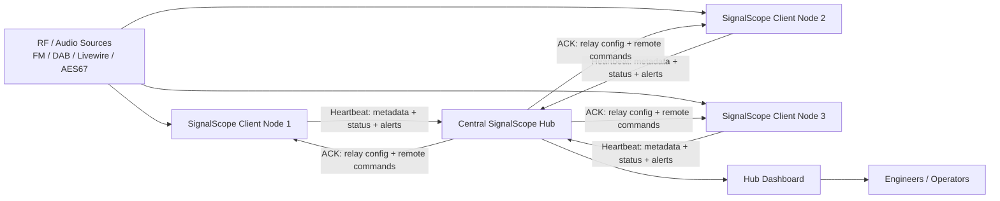

# SignalScope

SignalScope is a **web-based radio monitoring and signal analysis platform** designed for broadcast engineers and SDR enthusiasts.

It can ingest **FM, DAB and Livewire/AES67 audio streams**, analyse them in real time, and present the results in a modern web dashboard.
The system supports both **stand-alone monitoring nodes and distributed hub deployments** for network-wide signal monitoring.

SignalScope is written in **Python (Flask)** and designed to run easily on **Linux servers, VMs, and small systems like Raspberry Pi**.

---

## Install in 30 seconds

```bash
/bin/bash <(curl -fsSL https://raw.githubusercontent.com/itconor/SignalScope/main/install_signalscope.sh)
```

---

# 🚀 Quick Install

Clone the repository and run the installer:

```bash
git clone https://github.com/itconor/SignalScope.git
cd SignalScope
bash install_signalscope.sh
```

The installer will:

- Detect existing installations and offer to update in-place
- Install system dependencies
- Create the Python virtual environment
- Install required Python packages
- Configure the systemd service and self-healing watchdog
- Optionally configure NGINX as a reverse proxy
- Start SignalScope

Once complete, open:

```text
http://localhost:5000
```

The setup wizard will guide you through the rest.

---

# ⚡ One-Line Install

You can also install SignalScope directly using `curl`:

```bash
curl -sSL https://raw.githubusercontent.com/itconor/SignalScope/main/install_signalscope.sh | bash
```

### Optional safer version

If you prefer to inspect the script first:

```bash
curl -O https://raw.githubusercontent.com/itconor/SignalScope/main/install_signalscope.sh
bash install_signalscope.sh
```

---

# ✨ What's New in 2.6.51

## Security Hardening
- **Path traversal fix** — `clips_delete` now validates stream name and filename against the snippet directory boundary using `os.path.abspath` checks, matching the existing `clips_serve` pattern
- **DAB channel whitelist** — `/api/dab/test` now validates the channel parameter against an explicit allowlist of valid DAB channels; PPM offset is validated as a signed integer within ±1000
- **SDR scan authentication** — `/api/sdr/scan` now requires a valid login session
- **Flask secret key hardening** — secret key file is created with `0o600` permissions; `Content-Disposition` filenames are sanitised before being sent in headers

## Hub Improvements
- **Remote start/stop control** — hub operators can now start or stop monitoring on any client node directly from the hub dashboard; commands are delivered securely via the heartbeat ACK
- **Reliable command delivery** — hub-controlled fields (`relay_bitrate`, pending commands) are now explicitly preserved across heartbeat updates so queued commands are never silently dropped
- **Hub replica cards fixed** — `get_site()` now computes `online`, `age_s`, `health_pct`, and `latency_ms` dynamically, matching `get_sites()`; replica page cards now populate correctly
- **CSRF fixed across all hub templates** — CSRF token is written to a `csrf_token` cookie via an `after_request` hook; all hub JavaScript now reads the token from the cookie first, eliminating template-specific meta-tag misses

## DAB Improvements
- **Shared mux stability on Pi 4** — `welle-cli` processes are now started with elevated scheduling priority (`nice -10`) to reduce CPU contention when running 4+ DAB services simultaneously on ARM hardware

---

# ✨ What's New in 2.6.41–2.6.50

## Hub Dashboard
- **Live card updates working** — fixed a silent JavaScript error (`lastAlertState` undefined) that was preventing all AJAX DOM updates on the hub page
- **Cache-busting on `/hub/data`** — added `Cache-Control: no-store` headers and `?_=timestamp` fetch parameters to prevent NGINX/browser caching stale data
- **Reliable polling loop** — switched from `setInterval` to recursive `setTimeout` via `.finally()` to prevent timer stacking on slow connections
- **Instant refresh on tab focus** — Page Visibility API handler fires `hubRefresh` immediately when switching back to the hub tab
- **Reload-loop guard** — prevents "new site appeared" reloads from triggering more than once every 30 seconds
- **Start/Stop buttons** — remote monitoring control buttons use `data-` attributes and event delegation to avoid HTML injection issues with site names containing spaces

## DAB Improvements
- **Bulk-add service fix** — service names were being URL-encoded in JavaScript but not decoded in `_run_dab`; fixed with `urllib.parse.unquote()`
- **DAB add form UX** — name field and rule-based alert settings are hidden when DAB source type is selected
- **DAB station list styling** — service rows now match the app's blue theme
- **DLS text parsing** — `welle-cli` returns `dynamicLabel` as a JSON object; fixed to extract the `label` key
- **DLS display** — DLS text on hub cards uses the same scrolling marquee as RDS RadioText

## RDS / Metadata
- **RDS RadioText scrolling restored** — hub cards check `fm_rds_rt || dab_dls` in both template and AJAX refresh loop
- **DLS shown for DAB on hub cards** — `sc-rt-row` classes added to DAB DLS rows for live AJAX updates

## Monitoring
- **Clip threshold default** changed from `-3.0 dBFS` to `-1.0 dBFS` for more accurate clipping detection

## Hub Audio
- **Alert audio playback behind reverse proxy** — relay client sends an empty EOF chunk after WAV delivery so the hub closes the relay slot immediately rather than waiting for proxy timeout

---

# ✨ What's New in 2.6

## UI Improvements
- Moveable dashboard cards
- Improved layout and spacing
- Cleaner hub dashboard
- Improved top navigation and logo rendering

## Hub Improvements
- **Hub-only mode** removes the local dashboard
- Ability to remove dead clients
- Improved client visibility
- More metadata displayed on hub cards

## Metadata Enhancements
- Improved **RDS handling**
- Proper **RDS name locking**
- **RDS RadioText display**
- Improved DAB metadata support

## Monitoring Improvements
- Improved monitor reliability
- Better SDR restart handling
- Improved audio stream stability

## Stability Fixes
- Fixed setup wizard authentication bug
- Improved session handling
- Better fresh-install startup reliability

---

# 📡 Features

## Real-Time Signal Monitoring
- FM monitoring via **RTL-SDR**
- **DAB monitoring** with bulk service add
- **Livewire / AES67 stream monitoring**

## Metadata Detection
- RDS Program Service name
- RDS RadioText (scrolling display)
- DAB DLS now-playing text (scrolling display)
- DAB ensemble, service, mode, bitrate, signal strength

## Alerting & AI
- Rule-based alerts: silence, clipping, hiss
- **AI anomaly detection** — per-stream ONNX autoencoder, 24-hour learning phase
- Email, webhook (MS Teams Adaptive Cards), and Pushover notifications
- **SLA tracking** — monthly per-stream uptime percentage

## Distributed Monitoring
- Multi-node monitoring with a central **SignalScope Hub**
- Remote client reporting with HMAC-SHA256 + AES-256-GCM encryption
- Hub relay for audio playback through NAT / reverse proxies
- **Remote start/stop** — hub operators can control monitoring state on client nodes

## Web Dashboard
- Real-time monitoring interface with live AJAX updates
- Stream listen buttons (live audio in browser)
- Signal metadata display with scrolling RDS/DLS text
- Card-based monitoring layout with drag-to-reorder
- Wall mode for NOC/control room displays

## Security
- CSRF protection on all state-changing routes
- PBKDF2-SHA256 password hashing with session timeouts and login rate limiting
- Hub communication: HMAC signing, AES-256-GCM payload encryption, 30-second replay protection window, 60 RPM rate limiting
- Path traversal protection on all file-serving routes
- Input validation and channel whitelisting on SDR API endpoints

## Network Friendly
- Works behind reverse proxies (NGINX, Caddy, etc.)
- NAT-friendly hub communication
- Low bandwidth client reporting
- `ProxyFix` middleware with correct header forwarding

---

# 🖥 Dashboard

Example dashboard layout showing monitored stations and metadata.

_Add screenshot here_

```text
docs/images/dashboard.png
```

---

# 🌐 Hub Dashboard

The hub dashboard aggregates data from multiple SignalScope clients across the network.

_Add screenshot here_

```text
docs/images/hub-dashboard.png
```

---

# 🏗 Architecture

SignalScope uses a **hub and client monitoring model**.



Each client monitors local RF or IP audio sources and reports status, metadata, and monitoring data back to a central hub. The hub can issue commands back to clients on heartbeat ACKs — including remote start/stop of monitoring.

---

# 📻 Supported Inputs

| Source | Supported |
|------|------|
| RTL-SDR FM | ✅ |
| DAB via SDR | ✅ |
| Livewire audio streams | ✅ |
| AES67 streams | ✅ |
| Remote hub clients | ✅ |

---

# 🧰 Installation (Manual)

SignalScope runs on **Ubuntu / Debian systems**.

## Install dependencies

```bash
sudo apt update
sudo apt install -y \
python3 \
python3-venv \
rtl-sdr \
welle.io \
git
```

## Clone repository

```bash
git clone https://github.com/itconor/SignalScope.git
cd SignalScope
```

## Run installer

```bash
bash install_signalscope.sh
```

---

# ⚙ First Run Setup

The setup wizard will guide you through:

1. SDR configuration
2. Hub configuration (optional)
3. Authentication setup
4. Monitoring settings

After setup completes the **dashboard will load automatically**.

---

# 🌍 Hub Mode

SignalScope can operate as a **central hub server** receiving data from multiple monitoring nodes.

Hub features:

- Central monitoring dashboard with live AJAX updates (no page refresh needed)
- Aggregated station data with per-stream level bars, AI status and RDS/DLS text
- Remote node visibility with latency, heartbeat health %, and last-seen indicators
- **Remote start/stop** — control monitoring state on client nodes from the hub UI
- Client health monitoring with consecutive missed heartbeat tracking
- Alert sound and card flash on new ALERT/WARN events
- Wall mode for large-screen / NOC deployments
- Encrypted hub relay for audio playback from behind NAT

---

# 🔧 Watchdog

The installer configures a **systemd watchdog timer** that runs every minute and independently monitors:

- **SignalScope app** on port 5000 — restarts the `signalscope` service if unresponsive
- **NGINX** on ports 443/80 — restarts nginx if configured and unresponsive

Each service is monitored and restarted independently. Watchdog events are logged via `logger` and visible in the system journal:

```bash
journalctl -t signalscope-watchdog
```

---

# 📻 Supported SDR Hardware

- RTL-SDR
- RTL-SDR Blog V3
- RTL-SDR Blog V4
- Generic RTL2832U dongles

---

# 🛠 Project Status

SignalScope is under **active development**.

Current build: **SignalScope-2.6.51**

New features and improvements are added regularly.

---

# 🤝 Contributing

Pull requests and suggestions are welcome.

If you encounter issues please open a **GitHub issue**.

---

# 📜 License

MIT License
