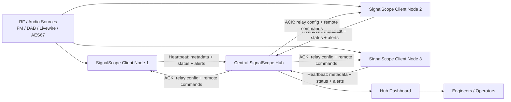

# SignalScope

SignalScope is a **web-based radio monitoring and signal analysis platform** designed for broadcast engineers and SDR enthusiasts.

It ingests **FM, DAB and Livewire/AES67 audio streams**, analyses them in real time, and presents results in a modern web dashboard. The system supports both **stand-alone monitoring nodes and distributed hub deployments** for network-wide signal monitoring.

SignalScope is written in **Python (Flask)** and designed to run on **Linux servers, VMs, and small systems like Raspberry Pi**.

---

## Quick Install

```bash
/bin/bash <(curl -fsSL https://raw.githubusercontent.com/itconor/SignalScope/main/install_signalscope.sh)
```

Or clone and run the installer:

```bash
git clone https://github.com/itconor/SignalScope.git
cd SignalScope
bash install_signalscope.sh
```

If you prefer to inspect the script first:

```bash
curl -O https://raw.githubusercontent.com/itconor/SignalScope/main/install_signalscope.sh
bash install_signalscope.sh
```

The installer will:

- Detect existing installations and offer to update in-place
- Install system dependencies (including `rtl-sdr`, `welle.io`, `libportaudio2`)
- Create the Python virtual environment and install required packages
- Configure the systemd service and self-healing watchdog
- Optionally configure NGINX as a reverse proxy with Let's Encrypt TLS
- Start SignalScope

Once complete, open `http://localhost:5000`. The setup wizard will guide you through the rest.

> 📖 **For a full walkthrough of every feature see [SignalScope User Guide](SignalScope_User_Guide.pdf)**

---

## Features Overview

| Category | What SignalScope does |
|---|---|
| **Inputs** | FM via RTL-SDR (with configurable de-emphasis), DAB via RTL-SDR, Livewire/AES67 (RTP multicast), HTTP/HTTPS audio streams, local ALSA/PulseAudio devices |
| **FM Scanner** | On-demand FM frequency tuning via RTL-SDR with live browser audio, RDS decoding, band scan, tuning history and presets; hub scanner page (`/hub/scanner`) |
| **Web SDR plugin** | Browser-based SDR with scrolling waterfall, click-to-tune, WFM/NFM/AM demodulation — installed via Settings → Plugins |
| **Logger plugin** | Continuous 24/7 compliance recording of any monitored stream; 5-minute segments with silence overlay, scrubable timeline with zoom/pan, show-name and track bands, mic on-air band, mark in/out clip export, right-click timeline markers, configurable recording format (MP3/AAC/Opus), per-stream quality tiers and configurable retention — installed via Settings → Plugins |
| **SignalScope Player** | Desktop companion app (Windows & macOS) for logger recordings; connects to a hub or a local recordings folder; zoomable/pannable timeline, skip ±30 s/±60 s, mark in/out clip export — download from [github.com/itconor/SignalScopePlayer](https://github.com/itconor/SignalScopePlayer) |
| **DAB Scanner plugin** | Browse all Band III DAB channels, stream services as MP3 via welle-cli, display DLS scrolling text — installed via Settings → Plugins |
| **Meter Wall plugin** | Full-screen PPM-style level bars for every monitored stream across all connected sites, LUFS-I readout, peak hold, RDS/DLS now-playing — installed via Settings → Plugins |
| **Codec Monitor plugin** | Real-time connection monitor for contribution codecs (Comrex ACCESS/BRIC-Link, Tieline, Prodys, APT/WorldCast); SNMP + HTTP scraping; CODEC_FAULT/CODEC_RECOVERY alerts; iOS mobile API — installed via Settings → Plugins |
| **Push Server plugin** | Centralised APNs/FCM push notification server — one hub delivers notifications for all connected SignalScope installations — installed via Settings → Plugins |
| **PTP Clock plugin** | Full-screen GPS-accurate wall clock; digital or analogue studio-clock display; live PTP offset/jitter; custom branding via URL parameter — installed via Settings → Plugins |
| **Zetta Integration plugin** | RCS Zetta broadcast automation integration; polls SOAP service for now-playing data, detects commercial blocks, provides WSDL discovery — installed via Settings → Plugins |
| **Morning Report plugin** | Auto-generated daily briefing at 06:00 covering fault summary, chain health, hourly heatmap, and notable patterns — installed via Settings → Plugins |
| **Signal Path Latency plugin** | Tracks comparator delay measurements over 90 days, SVG sparklines, drift/alert badges — installed via Settings → Plugins |
| **Icecast Streaming plugin** | Re-stream any monitored input to Icecast2; per-stream stereo toggle; hub overview shows live listener counts from all sites — installed via Settings → Plugins |
| **Listener plugin** | Polished station-card listening page for presenters and producers; live level meters, one-tap audio, animated equaliser, stereo badge, auto-reconnect — installed via Settings → Plugins |
| **Producer View plugin** | Simplified hub view for producers/presenters; station status cards, plain-English fault history, role-based login redirect — installed via Settings → Plugins |
| **AzuraCast plugin** | AzuraCast web radio integration; polls live now-playing, listener counts, and station health; AZURACAST_FAULT/RECOVERY alerts; optional cross-reference with SignalScope silence detection — installed via Settings → Plugins |
| **Sync Capture plugin** | Multi-site synchronized audio capture; simultaneous clip grab from any combination of inputs across all sites; EBU R128 LUFS/true-peak, sub-sample alignment, waveform comparison, octave-band spectrum, BWF export, DAW session export (REAPER .rpp + Audition .sesx) — installed via Settings → Plugins |
| **Level & loudness** | dBFS level, LUFS Momentary/Short-term/Integrated (EBU R128), true peak |
| **Metadata** | RDS PS name, RDS RadioText, stereo flag, TP/TA/PI; DAB service name, DLS now-playing text, ensemble/mode/bitrate/SNR |
| **Rule alerts** | Silence, clipping, hiss, LUFS true peak, LUFS integrated loudness |
| **Composite fault alerts** | STUDIO_FAULT, STL_FAULT, TX_DOWN (FM); DAB_AUDIO_FAULT, DAB_SERVICE_MISSING (DAB); RTP_FAULT (Livewire/AES67) |
| **Name mismatch alerts** | FM_RDS_MISMATCH, DAB_SERVICE_MISMATCH |
| **AI anomaly detection** | Per-stream ONNX autoencoder, 24 h learning phase, adaptive baseline, feedback-driven retraining (👍/👎 in Reports or Hub Reports). Stereo streams use 16-feature models (adds L–R correlation and L/R level imbalance) to detect dead-channel and phase faults that mono analysis misses |
| **Broadcast Chains** | Visual signal path builder with fault location, node stacking, ad break handling (including pass-through router topologies), maintenance bypass, flap detection, A/B group failover monitoring, chain health score, chain SLA, fault history with colour-coded audio replay timeline, all-node clip capture, predictive level trend, shared fault detection, historical time-travel view |
| **Stream comparator** | Cross-correlate pre/post processing pairs; detect processor failure, gain drift, dropout |
| **Metric history** | SQLite time-series, 90-day retention, signal history charts (15+ metrics), availability timeline, trend analysis |
| **Notifications** | Email (SMTP), MS Teams Adaptive Cards, Pushover, plain text webhooks, alert escalation |
| **Hub mode** | Multi-site aggregation, site approval, remote source management, wall mode, hub reports |
| **PTP monitoring** | Offset, jitter, drift, grandmaster change detection; values logged to metric history |
| **SLA tracking** | Monthly per-stream uptime percentage; chain SLA tracking |
| **Plugin system** | Drop-in `.py` plugins extend the UI with new pages and routes; install from the built-in plugin registry in Settings |
| **Security** | CSRF, PBKDF2-SHA256 passwords, HMAC+AES-256-GCM hub comms, session timeouts, rate limiting |
| **Backup & restore** | One-click ZIP backup of config, AI models, signal history DB, SLA data, alert log and hub state |

---

## Getting Started

### First Run

After installation, open `http://localhost:5000`. The setup wizard walks through:

1. **Authentication setup** — set an admin password
2. **SDR configuration** — detect and configure RTL-SDR dongles if present
3. **Hub configuration** — optionally configure this node as a hub client or hub server
4. **Monitoring settings** — silence threshold, alert cooldown, notification channels

After the wizard completes, the dashboard loads automatically.

### Adding Your First Input

1. Go to **Settings → Inputs** and click **+ Add Input**
2. Choose a source type, enter a name and device address (see the Inputs section below)
3. Save — monitoring starts within a few seconds

### Dashboard Overview

The dashboard shows a card for each monitored stream. Each card displays:

- Live level bar and dBFS reading
- LUFS Momentary/Short-term/Integrated values
- RDS Programme Service name and RadioText (FM), or DAB service name and DLS text (DAB)
- AI status badge (Learning / OK / Anomaly)
- Trend badge when level is notably above or below the expected range
- 24-hour availability timeline bar
- Alert/warning status strip on the card border
- Listen button for live audio in the browser — opens a sticky mini-player bar at the bottom of the page

Cards are drag-to-reorder. Alert cards sort to the top automatically.

### Hub Dashboard

The hub dashboard aggregates all connected sites in one view. A **search bar** at the top filters site cards in real time — type any site name, stream name, format (`DAB`, `FM`), alert text, device ID or AI status. The filter searches all card content including collapsed stream detail panels.

**Live level meters** — each stream card on the hub dashboard shows a PPM-style bouncing level bar that updates in real time at 5 Hz, independent of the 10-second heartbeat cycle. A peak-hold marker tracks the highest recent level with a slow decay. The bar uses colour zones (green / amber / red) to indicate programme, near-clip, and clip levels. Meters start immediately on page load using the last-known levels restored from state, and begin animating within one or two seconds of the monitoring loop connecting to audio.

Cards can be drag-reordered; the order persists across page reloads via localStorage.

---

## Inputs

### Source Types and Device Address Formats

| Source type | Address format | Example |
|---|---|---|
| FM via RTL-SDR | `fm://<frequency_MHz>` | `fm://96.3` |
| FM with specific dongle | `fm://<freq>?serial=<serial>&ppm=<offset>` | `fm://96.3?serial=00000001&ppm=-2` |
| DAB service | `dab://<ServiceName>?channel=<CH>` | `dab://Cool FM?channel=12D` |
| Livewire (multicast RTP) | `rtp://<multicast_address>:<port>` | `rtp://239.192.10.1:5004` |
| AES67 (RTP) | `rtp://<multicast_address>:<port>` | `rtp://239.69.0.1:5004` |
| HTTP/HTTPS audio stream | Full URL | `http://relay.example.com:8000/stream` |
| Local sound device | `sound://<device_index>` | `sound://2` |

### SDR Dongle Assignment

RTL-SDR dongles are configured in **Settings → SDR Devices**. Each dongle has a **Role**:

| Role | Use |
|---|---|
| `FM` | FM monitoring inputs |
| `DAB` | DAB monitoring inputs |
| `Scanner` | FM Scanner and Web SDR — exclusively reserved for on-demand tuning |
| `None` | Unassigned / general use |

Before adding FM or DAB inputs, assign the appropriate role to each dongle. The dongle dropdown on the Add Input form only shows compatible roles.

Dongles marked **Scanner** are reported to the hub in every heartbeat and used to populate the site selector on the FM Scanner and Web SDR pages. Only sites with at least one Scanner dongle will appear in those selectors.

### Adding FM Sources

1. In the Add Input form, select **FM**
2. Enter the frequency in MHz as the device address
3. Select the RTL-SDR dongle to use from the **Dongle** dropdown (register dongles in Settings → SDR Devices first)
4. Optionally set a PPM calibration offset
5. Save — SignalScope starts the RTL-SDR receiver and will begin reporting level, carrier strength, and RDS data

#### FM De-emphasis

FM broadcast transmitters apply pre-emphasis before transmission to reduce high-frequency noise on analogue FM. SignalScope applies matching de-emphasis after demodulation to restore flat frequency response and reduce perceived hiss.

Configure per-input in **Settings → Inputs → Edit → De-emphasis**:

| Setting | Region |
|---|---|
| **50 µs** (default) | Europe, Australia, Asia, most of the world |
| **75 µs** | North America, South Korea |
| **Off** | Disable (e.g. for data-only monitoring where flat response is required) |

### Adding DAB Sources

1. Select **DAB** in the Add Input form
2. Select a DAB channel (e.g. `12D`) and click **🔍 Scan Mux** to enumerate all services on that multiplex
3. Select one or more services from the list and click **➕ Add Selected Services**
4. Each service is added with its broadcast name and the correct `dab://` address automatically

Multiple DAB services on the same multiplex share a single `welle-cli` process, started with elevated scheduling priority (`nice -10`) to maintain stability on ARM hardware.

### Adding Livewire / AES67 Sources

Enter the multicast RTP address and port as the device address. SignalScope joins the multicast group and measures RTP packet loss and jitter (RFC 3550 EWMA) in addition to audio levels.

### Adding Local Sound Devices

Select **Local Sound Device** — a drop-down is populated from the OS device list via `/api/sound_devices`. Select a device (microphone, line-in, USB audio, loopback) and save. The device index is stored as `sound://<index>`.

---

## FM Scanner

The FM Scanner (`/hub/scanner`) lets you tune any FM frequency on demand and listen to live audio in the browser — without permanently adding the frequency as a monitored input.

Requires at least one RTL-SDR dongle configured with role **Scanner** in **Settings → SDR Devices**. Only sites with a Scanner dongle appear in the site selector.

### Using the FM Scanner

1. On the Hub page, click **📻 Scanner** (or navigate to `/hub/scanner`)
2. Select a site from the site dropdown
3. Enter an FM frequency in MHz and click **▶ Start** — audio begins streaming after a brief start-up delay
4. While streaming, type a new frequency and click **Tune** to retune without restarting

### Features

- **Live RDS** — Programme Service name, RadioText, stereo flag, TP/TA/PI decoded in real time
- **Tuning history** — recently tuned frequencies listed below the frequency field; click any entry to retune
- **Presets** — save frequently used frequencies; click to tune from any state (streaming or idle)
- **Band scan** — click **📡 Scan Band** to run a power sweep across the FM band and display strong stations as clickable peaks; the scan requires the dongle to be free (not streaming)
- **Click-to-tune** — clicking a history item, preset, or scan result peak while idle starts a new stream on that frequency; clicking while already streaming retunes immediately

### Audio Pipeline

The pipeline runs entirely in Python: `rtl_fm → resampling (scipy) → PCM → hub relay → browser Web Audio API`. End-to-end latency is typically 1–2 seconds RF to browser.

For WAN deployments where the hub is hosted remotely from the SDR client, the pipeline uses adaptive chunk batching to maintain real-time throughput regardless of round-trip time. The hub relay uses large read chunks (16 KB per read) to minimise WAN round trips — one POST per 0.5 s audio chunk for 256 kbps stereo streams.

---

## Logger Plugin

The Logger plugin (`logger.py`) provides continuous 24/7 compliance recording for any monitored stream, with a visual timeline browser and clip export.

Install it from **Settings → Plugins → Check GitHub for plugins**.

### Recording

Each stream you enable is recorded continuously as 5-minute clock-aligned segments stored under `logger_recordings/{stream}/{YYYY-MM-DD}/HH-MM.{ext}`. Recordings start as soon as the plugin is saved — no restart required.

Silence is detected inline using ffmpeg's `silencedetect` filter and stored per-segment in a local SQLite index.

**Recording formats** — choose per-stream in Logger Settings:

| Format | Extension | Notes |
|---|---|---|
| **MP3** (default) | `.mp3` | Universal compatibility |
| **AAC** | `.aac` | ~½ the storage of MP3 at equal quality |
| **Opus** | `.ogg` | Most efficient — quality at 64 kbps rivals MP3 at 192 kbps |

### Timeline

The **Timeline** tab shows a 24-hour overview at the top and a grid of 288 colour-coded 5-minute blocks below.

**Overview bar** — the green audio waveform bar at the top shows the full day at a glance. Click anywhere to jump to that time.

**Zoom and expand** — use the **1×/2×/4×/8× zoom buttons** to focus on a portion of the day. The **↕ Expand** button increases row heights for easier reading. At any zoom level you can **click and drag** horizontally to pan the timeline. Press **spacebar** to play/pause without losing your scroll position.

**Metadata bands** — between the overview bar and the hour grid:
- **Show band** (purple) — show name from now-playing metadata; consecutive events with the same show name are merged into one continuous block
- **Mic band** (green) — on-air periods recorded via the Mic REST API
- **Track band** (amber) — individual song start/end positions at exact timestamps

**Block colours:**

| Colour | Meaning |
|---|---|
| 🟢 Green | Segment recorded, audio present throughout |
| 🟡 Amber | Segment recorded, partial silence detected |
| 🔴 Red | Segment recorded, mostly or completely silent |
| ⬛ Dark | No recording for this time slot |

Click any block to load and play that 5-minute segment in the player bar.

### Playback & Clip Export

The player bar provides:

- **Scrub bar** — click or drag to seek within the loaded segment
- **Mark In / Mark Out buttons** — set clip boundaries at the current playback position
- **Right-click on the timeline** — right-click anywhere in the overview area to set markers directly. First right-click = mark in; second right-click = mark out; third = start a new in point
- **Export Clip** — extracts the marked range using ffmpeg and downloads it; ranges can span multiple consecutive segments (up to 2 hours)

**Export formats:**

| Format | Extension | Notes |
|---|---|---|
| **MP3** (default) | `.mp3` | Instant stream copy when recordings are also MP3 |
| **AAC** | `.m4a` | 128 kbps; ~½ size of MP3 |
| **Opus** | `.webm` | 96 kbps; most efficient; Chrome/Firefox/Edge/Safari 16.4+ |

### Hub Mode

In hub deployments, the Logger plugin supports browsing and playing recordings from any connected client node — without the files ever leaving the client's disk. The hub acts as a relay: raw audio file bytes are streamed from the client's recording directory through the hub to the operator's browser or desktop player. No transcoding occurs on the hub.

### Multi-Node Shared Recordings

When multiple logger instances write to a shared network directory (NFS/SMB), each node writes its own **per-instance sidecar JSON** (`meta_{node}.json`) alongside each day's segments. Readers merge all sidecar files by timestamp, so metadata from every node is visible regardless of which machine generated it. No cross-process locking or shared SQLite access is required.

### Now-Playing Metadata Integration

Logger polls a now-playing API every 30 seconds to populate show name and track metadata. Supported sources:

- **Planet Radio API** — select a station from the dropdown in Logger Settings; the URL is filled automatically
- **Triton Digital** — enter the Triton JSON endpoint URL
- **Any JSON API** — enter a custom URL; Logger will attempt to extract title/artist/show fields from the response
- **Fallback** — if no API is configured, DLS (DAB) or RDS RadioText (FM) metadata is used automatically

### Mic On-Air REST API

Trigger mic-on/mic-off events from broadcast automation or a hardware controller:

```
POST /api/logger/mic
Content-Type: application/json
Authorization: Bearer <mic_api_key>

{"stream": "cool-fm", "state": "on", "label": "Studio A"}
```

The `mic_api_key` is configured in Logger Settings. Session cookie authentication is also accepted. Events appear immediately on the timeline green mic band.

### Quality Tiers & Retention

Configure per-stream in the **Settings** tab:

| Setting | Default | Description |
|---|---|---|
| Format | MP3 | Recording format (MP3 / AAC / Opus) |
| HQ Bitrate | 128k | Bitrate for new recordings |
| LQ Bitrate | 48k | Bitrate after quality downgrade |
| LQ after (days) | 30 | Re-encode to LQ after this many days |
| Delete after (days) | 90 | Purge recordings after this many days |

A background thread runs hourly, re-encoding older segments to the LQ bitrate and deleting segments beyond the retention period.

---

## SignalScope Player

SignalScope Player is a standalone desktop application for browsing and playing back logger recordings on **Windows** and **macOS**. It connects either directly to a local or network recordings folder, or to a SignalScope hub over HTTPS using the mobile API token.

**Download:** [github.com/itconor/SignalScopePlayer/releases](https://github.com/itconor/SignalScopePlayer/releases)

### Modes

| Mode | How it connects | Use case |
|---|---|---|
| **Direct** | Points at a local or network-mounted recordings directory | Engineer on same LAN as recordings; NFS/SMB share |
| **Hub** | Connects to a SignalScope hub URL with a mobile API Bearer token | Remote access from anywhere; audio relayed through hub |

### Features

- **Stream & date browser** — select any monitored stream and calendar date; the full day loads in seconds
- **Zoomable timeline** — scroll to zoom (1×–48×), click and drag to pan; double-click to reset
- **Metadata bands** — show name (purple), track (amber), mic on-air (green) bands aligned to the timeline
- **Segment grid** — optional colour-coded 5-minute block grid (hidden by default; toggle with the grid button)
- **Exact-time seeking** — click anywhere on the timeline to seek to that precise second
- **Skip controls** — « 1m · ‹ 30s · 30s › · 1m » buttons in the player bar; work across segment boundaries and in hub relay mode
- **Scrub bar** — drag to seek within the current segment
- **Mark In / Mark Out** — set clip boundaries and export using ffmpeg (direct mode)
- **Auto-advance** — at end of a segment, playback continues automatically into the next

### Hub Relay Streaming

In hub mode the player does not download files — the hub streams the original OGG/MP3/FLAC bytes directly from the client node to the player in real time. Seeking (including via skip buttons) is handled by an ffmpeg seek on the client side before streaming begins. No audio is stored on the hub.

### Connection

On first launch a connection dialog appears. Enter the hub URL and mobile API token (generated in **Settings → Mobile API**), or browse to a local recordings directory. Credentials are saved for subsequent launches.

---

## Plugin System

SignalScope supports drop-in plugins. Any `.py` file in the `plugins/` subdirectory that contains the string `SIGNALSCOPE_PLUGIN` is loaded automatically at startup and can register new Flask routes and nav bar items.

> **Note:** Older releases stored plugins alongside `signalscope.py` in the root directory. On first run after upgrading, SignalScope automatically migrates any root-level plugin files (and their associated config files) into the `plugins/` subdirectory.

### Installing Plugins

Go to **Settings → Plugins** to:

- View installed plugins and their active/restart-needed status
- Browse the official plugin registry on GitHub
- Install plugins with one click — the file is downloaded, validated, and saved to the SignalScope directory
- Remove plugins — the file is deleted; a restart completes the unload

A restart is required to activate or fully unload a plugin after installing or removing.

### Available Plugins

#### FM Scanner (built-in)
Live FM frequency tuning with RDS, band scan, presets, and browser audio. See [FM Scanner](#fm-scanner) above.

#### Web SDR (`sdr.py`)
Browser-based software defined radio at `/hub/sdr`:
- Scrolling waterfall display with colour-coded signal intensity
- Click anywhere on the waterfall to tune to that frequency
- Demodulation modes: WFM, NFM, AM
- Requires a dongle configured with role **Scanner**

#### Logger (`logger.py`)
24/7 compliance recording. See [Logger Plugin](#logger-plugin) above.

#### DAB Scanner (`dab.py`)
Browse and stream DAB digital radio services at `/hub/dab`:
- Scans all Band III channels to discover available services
- Stream any service as MP3 audio via welle-cli and ffmpeg
- Displays DLS Dynamic Label Segment scrolling text
- Requires `welle-cli` and `ffmpeg` on the client machine

#### Meter Wall (`meterwall.py`)
Full-screen audio level display at `/hub/meterwall`:
- PPM-style level bars for every monitored stream across all connected sites
- Peak hold with decay, LUFS-I readout, alert flash
- RDS/DLS now-playing text per stream
- Site grouping, configurable grid density, auto-hiding fullscreen kiosk mode

#### Codec Monitor (`codec.py`)
Real-time connection monitor for broadcast contribution codecs at `/hub/codecs`:
- Monitors Comrex ACCESS / BRIC-Link, Tieline Gateway / ViA, Prodys Quantum ST, APT/WorldCast Quantum
- Polls each device via HTTP status-page scraping or SNMP
- Tracks connected / idle / offline state with colour-coded status indicators
- Fires **CODEC_FAULT** and **CODEC_RECOVERY** alerts into the SignalScope Reports page on state changes
- Mobile API at `/api/mobile/codecs/status` for the iOS companion app
- Runs on both hub and client nodes

#### Push Server (`push.py`)
Centralised push notification server at `/hub/push`:
- Turns a SignalScope hub into a single delivery point for iOS (APNs) and Android (FCM) push notifications
- Stores APNs `.p8` key and FCM service account JSON credentials
- Any SignalScope installation — including remote client nodes — can point its **Push Server URL** here and delegate all push delivery
- Includes one-click migration from existing local Settings credentials
- Hub-only

#### PTP Clock (`ptpclock.py`)
Full-screen GPS-accurate studio wall clock at `/hub/ptpclock`:
- **Digital mode** — large HH:MM:SS with tenths-of-second display
- **Analogue mode** — smooth sweep second-hand studio clock
- Live PTP sync status, offset, and jitter from the GPS-disciplined server clock
- Accurate on any browser on the LAN — no local GPS required on the viewing device
- Custom branding via `?brand=` URL parameter
- Link it from a studio display for a broadcast-quality clock with zero additional hardware

#### Zetta Integration (`zetta.py`)
RCS Zetta broadcast automation integration at `/hub/zetta`:
- Polls the Zetta SOAP service to show live now-playing data (title, artist, cart number, category)
- Detects commercial/spot blocks in real time
- Provides `/api/zetta/status` for chain and external integration
- Includes WSDL discovery and raw SOAP debug console
- No additional pip packages required

#### Morning Report (`morning_report.py`)
Daily broadcast engineering briefing at `/hub/morning_report`:
- Auto-generates at 06:00 (configurable) covering the previous calendar day
- At-a-glance fault summary, per-chain health table with on-air %, hourly fault heatmap
- Traffic-light trend pills, human-readable outage durations, plain-English column headers
- Auto-detected notable patterns (clustering, above-average faults, recurring issues, clean streaks)
- Stream quality summary. All configured chains appear even with no fault history
- Hub-only

#### Signal Path Latency (`latency.py`)
Latency tracking for broadcast chains at `/hub/latency`:
- Polls all connected sites for comparator delay measurements every 30 seconds
- Stores 90 days of history in SQLite, computes rolling baselines
- Displays per-comparator SVG sparklines, stable/drifting/alert status badges
- Configurable alert thresholds per comparator pair
- Hub-only

#### Icecast Streaming (`icecast.py`)
Re-stream any monitored input to Icecast2 at `/hub/icecast`:
- Re-stream any monitored input type (FM/RTL-SDR, DAB, ALSA, RTP, HTTP) to an Icecast2 server
- Per-stream stereo toggle — HTTP inputs preserve native stereo; all others upmix mono to dual-mono
- Hub overview shows live listener counts and stream status from all connected sites
- Create and manage streams on any client from the hub
- Requires ffmpeg; Icecast2 installed separately

#### Listener (`listener.py`)
Live stream listening page for presenters and producers at `/hub/listener`:
- Polished station cards with live level meters and one-tap audio playback
- Stereo streams show a STEREO badge and play in stereo in the now-playing bar
- Auto-reconnects, animated equaliser, volume control, mobile-friendly
- Hub-only

#### Producer View (`presenter.py`)
Simplified hub view for producers and presenters at `/hub/presenter`:
- Station status cards with live level indicators
- Plain-English chain fault history readable by non-technical staff
- Clips from remote client sites always available (asynchronous upload)
- Users assigned the **Producer** role are redirected here automatically on login
- Hub-only

#### AzuraCast (`azuracast.py`)
AzuraCast web radio integration at `/hub/azuracast`:
- Polls configured AzuraCast servers for live now-playing data, listener counts, and station health
- Station cards show current track, artist, progress bar, next track, live/AutoDJ status, and listener count
- Fires **AZURACAST_FAULT** and **AZURACAST_RECOVERY** alerts when stations go offline or recover
- Optionally cross-references with SignalScope silence detection — fires **AZURACAST_SILENCE** if a station is broadcasting but its linked SignalScope input is silent
- Hub overview aggregates all stations from all connected sites

#### Sync Capture (`synccap.py`)
Multi-site synchronized audio capture at `/hub/synccap`:
- Select any combination of inputs from any connected sites, set a capture duration (5–300 s), and press Capture
- The hub broadcasts a timestamped command; each client grabs the last N seconds from its rolling audio buffer and uploads the clip
- All clips are presented together with inline audio players for side-by-side listening and comparison
- Per-clip EBU R128 LUFS and true-peak analysis, sub-sample cross-correlation alignment, waveform comparison overlay, octave-band spectrum
- **⇌ Align** button auto-aligns all clips by cross-correlating their audio content
- **💾 DAW Session** button downloads a ZIP of all WAV clips plus a REAPER `.rpp` and Adobe Audition `.sesx` session file — with alignment offsets baked in if alignment has been run
- BWF broadcast-wave export with timecode metadata per clip
- Hub-only

### Writing a Plugin

Drop a `.py` file into the `plugins/` subdirectory:

```python
SIGNALSCOPE_PLUGIN = {
    "id":      "myplugin",
    "label":   "My Plugin",
    "url":     "/hub/myplugin",
    "icon":    "🔧",
    # "hub_only": True,   # hide nav item when node is in client-only mode
}

def register(app, ctx):
    login_required = ctx["login_required"]
    monitor        = ctx["monitor"]

    @app.get("/hub/myplugin")
    @login_required
    def myplugin_page():
        return "<h1>My Plugin</h1>"
```

Any route under `/api/mobile/...` must use `ctx["mobile_api_required"]` (not `login_required`) so it accepts Bearer token authentication from the iOS app.

See `CLAUDE.md` in the repository for full plugin authoring documentation including audio relay integration, hub↔client command patterns, SDR IQ capture recipes, the browser audio pump JS, and the complete `ctx` key reference.

---

## Alerting

### Alert Types

**Level alerts** (apply to all source types):

| Alert | Condition |
|---|---|
| `SILENCE` | Audio level falls below the configured silence floor |
| `CLIP` | Audio level reaches or exceeds the clip threshold (default −1.0 dBFS) |
| `HISS` | High-frequency noise floor detected above threshold |
| `LUFS_TP` | True peak exceeds configured dBTP threshold (default −1.0 dBTP) |
| `LUFS_I` | 30-second integrated loudness deviates from EBU R128 target (default −23 LUFS ± 3 LU) |
| `GLITCH` | Brief audio dropout detected — onset rate, recovery rate, dip depth, and pre-dip trend are all evaluated to filter out fade transitions and music dynamics before an alert fires |

**Composite fault alerts** (silence is diagnosed automatically):

| Alert | Source | What it means |
|---|---|---|
| `STUDIO_FAULT` | FM | Silence + carrier present + RDS present → playout/studio failure |
| `STL_FAULT` | FM | Silence + carrier present + RDS absent → STL/link failure |
| `TX_DOWN` | FM | Silence + weak/no carrier + no RDS → transmitter or RF failure |
| `DAB_AUDIO_FAULT` | DAB | Silence + mux locked + SNR ≥ 5 dB → studio/playout fault |
| `DAB_SERVICE_MISSING` | DAB | Ensemble locked but configured service absent from mux |
| `RTP_FAULT` | Livewire/AES67 | Silence + ≥ 10% packet loss → network fault |

**Metadata mismatch alerts**:

| Alert | Condition |
|---|---|
| `FM_RDS_MISMATCH` | Received RDS PS name differs from configured expected name, or changes unexpectedly |
| `DAB_SERVICE_MISMATCH` | Received DAB service name differs from configured expected name, or changes unexpectedly |

**AI and chain alerts**:

| Alert | Condition |
|---|---|
| `AI_ANOMALY` | AI autoencoder reconstruction error exceeds learned threshold |
| `CMP_ALERT` | Post-processing stream silent while pre-processing stream has audio |
| `CHAIN_FAULT` | First down node identified in a broadcast chain |
| `CHAIN_RECOVERED` | Previously faulted chain returns to fully OK |
| `CHAIN_FLAPPING` | Chain has faulted and recovered 3+ times within 10 minutes |
| `CODEC_FAULT` | Contribution codec transitioned to idle or offline state |
| `CODEC_RECOVERY` | Contribution codec returned to connected state |

### Setting Expected RDS / DAB Names

On any FM stream card, click **📌 Set** next to the live RDS PS name to pin it as the expected name. A ✓ indicator appears when the received name matches; ⚠ appears with the expected name on mismatch. Click **📌 Update** to re-pin to the current name. The same button is available on DAB stream cards for the service name.

### Notification Channels

Configure notification channels in **Settings → Notifications**:

- **Email (SMTP)** — standard SMTP with TLS
- **MS Teams** — Adaptive Card format with colour-coded severity, or plain text webhook
- **Pushover** — mobile push notifications with priority levels
- **Webhook** — generic HTTP POST with JSON payload; configurable URL and headers

All channels receive the same alert types and can be tested from the Settings page.

### Escalation

Set a per-stream escalation timeout (minutes) in stream settings. If an alert remains unacknowledged after that period, all configured notification channels fire again. Set to 0 to disable.

### Alert Cooldown

A 60-second cooldown prevents duplicate notifications for the same alert type on the same stream. Alert history is always written regardless of cooldown state.

---

## Broadcast Chains

Broadcast Chains model the physical signal path of a service as an ordered sequence of monitoring points. The hub identifies the first failed point and fires a named alert with a specific fault location.

Configure and view chains at **Hub → Broadcast Chains**.

### Creating a Chain

1. Click **+ New Chain** and give it a name (e.g. `Cool FM Distribution`)
2. Click **+ Add Node** for each point in the signal path, in source-to-destination order:
   - **Site** — `This node (local)` for streams on the hub, or any connected remote site
   - **Stream** — populated from the selected site
   - **Label** — optional friendly name; defaults to the stream name
   - **Machine tag** — optional hardware identifier used for cross-chain shared fault correlation
3. Click **💾 Save Chain**

### Node Stacking

Place multiple streams at the same chain position to model parallel monitoring. Each stack has a fault mode:

- **Fault if ALL silent** — use for redundant receivers
- **ANY down = fault** — use when every path is required

### Ad Break Handling

SignalScope suppresses false fault alerts during ad breaks using two detection paths:

**With a mix-in point configured** — mark one chain node as the **Ad mix-in point** (the node where the ad server or automation feeds in). While that node is carrying audio, upstream silence is treated as an ad break and held for the **Fault confirmation delay** before any alert fires.

**Without a mix-in point** — when a "fault-if-ALL-silent" stack at the start of the chain goes silent but at least one downstream node is actively carrying audio, SignalScope recognises this as an ad break automatically. This handles pass-through router topologies where the node immediately after the codec stack mirrors studio silence momentarily, while audio processing and TX continue to receive audio from the ad server.

In both cases the badge shows **AD BREAK** (amber) rather than **FAULT** (red) during the confirmation window. If the audio returns within the window, no alert is sent and no SLA downtime is recorded.

### Node Maintenance Bypass

Mark any node as **In Maintenance** to exclude it from fault detection for a set duration. The node shows a maintenance badge and is skipped during chain evaluation until the timer expires.

### Chain Health Score

Each chain shows a live health score (0–100):

| Component | Weight |
|---|---|
| 30-day SLA | 0–70 pts |
| Fault frequency (last 7 d) | 0–20 pts |
| Stability (flapping) | 0–10 pts |
| Trending-down nodes | −5 per node (max −15) |
| RTP packet loss | 0 to −10 pts |

Colour-coded labels: **Healthy** (≥ 90) · **Watch** (75–89) · **Degraded** (50–74) · **Poor** (< 50).

### A/B Group Monitoring

Create **A/B groups** to monitor failover pairs across chains. An A/B group tracks two chains (the A-chain and B-chain) and alerts if the active chain faults while the standby chain is also degraded — catching silent failover failures before they become on-air incidents. Configure groups at **Hub → Broadcast Chains → + New A/B Group**.

### Fault History & Audio Replay

Each chain maintains a rolling log of the last 50 fault/recovery events. At fault time, audio clips are saved for **every node** in the chain. Click **🎬 Replay** on any fault entry to open an inline replay timeline with clips colour-coded by signal-path position — fault point (red), last-good clip (green), and each recovery position in its own distinct colour (amber, cyan, purple, pink…). **▶ Play All** plays through clips sequentially with the active node highlighted.

### Historical Chain View

Use the **📅 View History** picker to reconstruct how a chain appeared at any past date and time using stored metric history. Useful for post-incident review without relying on alert logs alone.

### Signal Comparators

Add correlation comparators between chain positions to measure signal integrity across a section. Click-to-listen is supported on every node bubble.

---

## Hub Mode

SignalScope can aggregate data from multiple monitoring client nodes.

### Setting Up a Hub

Enable hub mode in **Settings → Hub**. Set a hub secret key — all client nodes must use the same key. Client nodes connect by configuring the hub URL and secret in their own **Settings → Hub** page.

### Site Approval

New connections wait in **Pending Approval** until a hub admin approves them. Sites persist until explicitly removed and are never pruned automatically regardless of offline duration.

### Remote Management

From the hub dashboard, operators can start/stop monitoring, add or remove sources (including DAB scan-and-bulk-add), and view aggregated hub reports — all without logging into individual client nodes.

Each stream card on the hub overview includes inline controls queued to the client on the next heartbeat (~10 s):

| Control | Available for |
|---|---|
| **✅ Enable / ⏸ Disable** | All source types |
| **🔊 Stereo ON / 🔈 OFF** | DAB, HTTP, ALSA, RTP — not FM (FM stereo is auto-detected via pilot tone) |

### Hub Notification Delegation

Configure a client to suppress its own notifications and delegate to the hub, which can apply per-site forwarding rules and deduplication by event UUID.

### Wall Mode

Open `/hub?wall=1` (or click **🖥 Wall Mode** from the hub dashboard) for a large-screen kiosk overview:

- **Header bar** — live clock, summary pills (alert/warn/offline counts), exit button
- **Connected Sites strip** — one pill per site with coloured status dot and alert count
- **Broadcast Chains panel** — each chain is a card showing the signal path left→right in a single scrollable horizontal flow. Redundancy stacks list each feed as a compact row (status dot · name · level bar · dB value) rather than tall column widgets. Each position is labelled P1, P2, P3… for fast fault location. Cards update every 5 seconds.
- **Stream Status grid** — one card per stream across all sites with level bar, format badge, and site name

The page auto-reloads every 60 seconds to pick up newly connected sites.

### Architecture



Each client monitors local RF or IP audio sources and reports status, metadata, and alert data to the hub via HMAC-signed, AES-256-GCM encrypted heartbeats every ~10 seconds. In addition, clients push slim live metric frames (level, peak, silence state) to the hub at 5 Hz so that level bars and chain evaluation update in sub-second time. The hub issues commands back to clients on heartbeat ACKs.

---

## Mobile API & iOS App

SignalScope includes a mobile API (`/api/mobile/*`) for companion iOS app integration.

### Authentication

All mobile API endpoints require a Bearer token (or `X-API-Key` header / `?token=` query parameter). Generate or rotate the token in **Settings → Mobile API**.

### Key Mobile API Endpoints

| Endpoint | Method | Description |
|---|---|---|
| `/api/mobile/status` | GET | All monitored streams with live metrics and AI status |
| `/api/mobile/faults` | GET | Active fault chains |
| `/api/mobile/reports/events` | GET | Alert event history with `limit=` and `before=` cursor pagination |
| `/api/mobile/metrics/history` | GET | Time-series metric data; params: `stream`, `metric`, `hours`, `site` |
| `/api/mobile/hub/overview` | GET | Hub sites summary with per-site stream list and alert counts |
| `/api/mobile/register_token` | POST | Register an APNs device token for push notifications |
| `/api/mobile/logger/catalog` | GET | List of recorded streams across all connected sites |
| `/api/mobile/logger/play_file` | POST | Relay a logger recording through the hub to a desktop player |
| `/api/mobile/logger/audio_file` | GET | Serve a logger recording directly (single-node hub or direct mode) |
| `/api/mobile/codecs/status` | GET | Codec Monitor — live status of all monitored contribution codecs |

### iOS App Features

- **Dashboard** — live stream cards with level bars, LUFS, AI status, alert badges, pull-to-refresh, push notifications
- **Active Faults** — list of active fault chains with age, SLA, and acknowledgement; deep-link from push notification taps
- **Reports** — paginated alert event history with search, site/type filters, clips-only toggle, cursor-based pagination
- **Hub Overview** — per-site stream list with RDS PS name / DAB service name, now-playing text, format badge, SLA, RTP loss
- **Signal History** — full-screen Swift Charts chart for any stream; 1 h / 6 h / 24 h range; 8+ selectable metrics
- **Audio playback** — AVPlayer for live streams and fault audio clips

---

## Metric History & Analytics

### SQLite History

SignalScope writes per-stream metrics to `metrics_history.db` once per minute. Data is retained for 90 days (pruned automatically daily).

| Metric | Streams | Description |
|---|---|---|
| `level_dbfs` | All | Audio level in dBFS |
| `lufs_m`, `lufs_s`, `lufs_i` | All | LUFS Momentary, Short-term, Integrated |
| `silence_flag` | All | 1.0 = currently silent |
| `clip_count` | All | Clipping events per snapshot window |
| `fm_signal_dbm` | FM | RF carrier strength |
| `fm_snr_db` | FM | Signal-to-noise ratio |
| `fm_stereo` | FM | 1.0 = stereo pilot present |
| `fm_rds_ok` | FM | 1.0 = RDS lock confirmed |
| `dab_snr` | DAB | DAB signal-to-noise ratio |
| `dab_ok` | DAB | 1.0 = service present in ensemble |
| `dab_sig` | DAB | DAB signal level dBm |
| `dab_bitrate` | DAB | Service bitrate in kbps |
| `rtp_loss_pct` | RTP/AES67 | Packet loss percentage |
| `rtp_jitter_ms` | RTP/AES67 | Jitter (RFC 3550 EWMA) in milliseconds |
| `ptp_offset_us` | PTP | Clock offset in microseconds |
| `ptp_jitter_us` | PTP | PTP jitter in microseconds |
| `ptp_drift_us` | PTP | PTP drift in microseconds |
| `chain_status` | Chains | 1.0 = OK, 0.0 = faulted |
| `health_pct` | Hub sites | Heartbeat success rate % |
| `latency_ms` | Hub sites | Round-trip heartbeat latency in milliseconds |

### Signal History Charts

Click **📈 Signal History** on any stream card to expand a chart. Select a time range (1 h / 6 h / 24 h) and a metric — all applicable metrics for the stream type are listed.

### Availability Timeline

A colour-coded bar below each stream card shows availability at a glance:

- 🟢 Green — signal present
- 🔴 Red — silence / audio floor
- 🟡 Amber — DAB service missing
- ⬛ Dark — no data

Click the bar to cycle between 24 h, 1 h, and 6 h views.

### Trend Analysis

SignalScope builds an hour-of-day baseline (14-day rolling) and a day-of-week baseline (28-day rolling). When current level deviates more than ±1.5σ, a trend badge is shown:

- `📉 Lower than usual (−2.1σ)` — amber; escalates to red after ≥ 10 minutes

---

## AI Anomaly Detection

Each stream has its own ONNX autoencoder model that learns a baseline of normal audio behaviour:

- **Learning phase** — trains continuously for 24 hours after a stream is added; no anomaly alerts during this period
- **Detection** — after the learning phase, reconstruction error is compared to a learned baseline; 3 consecutive anomalous windows trigger `AI_ALERT` or `AI_WARN`
- **Adaptive baseline** — the model continuously tracks slow long-term changes via exponential moving average
- **Feedback-driven retraining** — click 👍 (false alarm) or 👎 (confirmed fault) on any AI event in Reports; 5 false-alarm labels trigger an automatic retrain using the full original 24 h corpus plus all corrected samples

### Mono vs Stereo Models

Mono streams use **14 audio features** (level, peak, crest factor, DC offset, clipping, short-term level variance, spectral flatness, rolloff, noise floor, hum, HF energy, zero-crossing rate, and a signal sanity composite).

Stereo streams automatically use **16-feature models** with two additional channel-relationship features:

| Feature | What it detects |
|---|---|
| **L–R correlation** | Dead channel (one side silent), severe phase inversion, or unexpected L/R decorrelation |
| **L/R RMS imbalance** | Channel level imbalance — one side significantly quieter or louder than the other |

Stereo streams produce distinct AI fault labels: `stereo channel imbalance` and `stereo phase / channel fault`, in addition to all the standard mono labels.

If a stream's stereo mode changes (e.g. you enable stereo capture on a DAB feed that previously had a mono-trained model), the model dimension mismatch is detected automatically and a new 16-feature learning phase begins.

---

## Stream Comparator

Pair two streams as PRE and POST to monitor signal integrity through a processing chain:

- Cross-correlates streams to measure processing delay
- **CMP_ALERT** fires when the post stream goes silent while the pre stream has audio
- Gain drift alerts fire when the level difference exceeds a threshold

Configure pairs in **Settings → Comparators**.

---

## SLA Tracking

Monthly per-stream uptime is tracked as a percentage. Chains have their own SLA — confirmed fault time only; ad break countdowns and maintenance periods are excluded.

SLA data is displayed in Hub Reports and stored in `sla_data.json`.

---

## Security

- **Authentication** — PBKDF2-SHA256 password hashing, session timeouts, login rate limiting
- **CSRF protection** — all state-changing routes require a valid CSRF token
- **Hub communication** — HMAC-SHA256 signing, AES-256-GCM payload encryption, 30-second replay window, 60 RPM rate limiting per client
- **Path traversal protection** — all file-serving routes validate paths against the application directory
- **SDR API** — DAB channel validated against an explicit allowlist; PPM offset validated as signed integer within ±1000
- **Plugin install** — URL must originate from the official GitHub repository; downloaded file must contain `SIGNALSCOPE_PLUGIN` before it is written to disk

---

## Supported Hardware

| SDR Hardware | Supported |
|---|---|
| RTL-SDR Blog V3 | ✓ |
| RTL-SDR Blog V4 | ✓ |
| Generic RTL2832U dongles | ✓ |

| Input Type | Supported |
|---|---|
| RTL-SDR FM | ✓ |
| DAB via RTL-SDR | ✓ |
| Livewire / AES67 streams | ✓ |
| HTTP/HTTPS audio streams | ✓ |
| Local ALSA/PulseAudio devices | ✓ |

---

## Watchdog

The installer configures a systemd watchdog timer that monitors SignalScope on port 5000 and NGINX on ports 443/80, restarting each independently if unresponsive.

```bash
journalctl -t signalscope-watchdog
```

---

## Backup & Migration

**Settings → Maintenance → Backup & Restore** downloads a timestamped ZIP containing:

| File | Contents |
|---|---|
| `lwai_config.json` | All configuration and stream settings |
| `ai_models/` | Trained ONNX models, baseline stats, feedback state, and 24 h training corpora |
| `metrics_history.db` | Signal history database (90 days) |
| `sla_data.json` | SLA uptime records |
| `alert_log.json` | Full alert event history |
| `plugins/logger_index.db` | Logger plugin recording index and metadata database |
| `hub_state.json` | Hub site registrations and connection state |

To restore, upload the ZIP via **Settings → Maintenance → Restore from Backup**. To migrate, install SignalScope on the target machine and restore from backup — full history and configuration will be intact.

**In-app self-update** is available in **Settings → Maintenance**. The **Apply Update & Restart** button downloads and validates the latest `signalscope.py` from GitHub, replaces the running file, and sends SIGTERM — the systemd service and watchdog handle the restart.

---

## Contributing

Pull requests and suggestions are welcome. Please open a GitHub issue for bugs or feature requests.

---

## License

MIT
