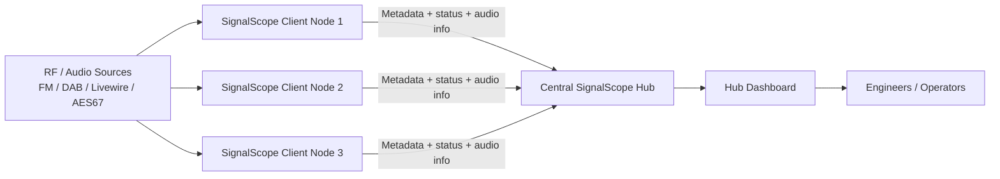

# SignalScope

SignalScope is a **web-based radio monitoring and signal analysis platform** designed for broadcast engineers and SDR enthusiasts.

It can ingest **FM, DAB and Livewire/AES67 audio streams**, analyse them in real time, and present the results in a modern web dashboard.  
The system supports both **stand-alone monitoring nodes and distributed hub deployments** for network-wide signal monitoring.

SignalScope is written in **Python (Flask)** and designed to run easily on **Linux servers, VMs, and small systems like Raspberry Pi**.

---

## Install in 30 seconds

```
/bin/bash <(curl -fsSL https://raw.githubusercontent.com/itconor/SignalScope/main/install_signalscope.sh)
```

---

# 🚀 Quick Install

Clone the repository and run the installer:

```bash
git clone https://github.com/itconor/SignalScope.git
cd SignalScope
bash install_signalscope.sh
```

The installer will:

- Install system dependencies
- Create the Python environment
- Install required Python packages
- Configure the service
- Start SignalScope

Once complete, open:

```text
http://localhost:5000
```

The setup wizard will guide you through the rest.

---

# ⚡ One-Line Install

You can also install SignalScope directly using `curl`:

```bash
curl -sSL https://raw.githubusercontent.com/itconor/SignalScope/main/install_signalscope.sh | bash
```

### Optional safer version

If you prefer to inspect the script first:

```bash
curl -O https://raw.githubusercontent.com/itconor/SignalScope/main/install_signalscope.sh
bash install_signalscope.sh
```

---

# ✨ What's New in 2.6

## UI Improvements
- Moveable dashboard cards
- Improved layout and spacing
- Cleaner hub dashboard
- Improved top navigation and logo rendering

## Hub Improvements
- **Hub-only mode** removes the local dashboard
- Ability to remove dead clients
- Improved client visibility
- More metadata displayed on hub cards

## Metadata Enhancements
- Improved **RDS handling**
- Proper **RDS name locking**
- **RDS RadioText display**
- Improved DAB metadata support

## Monitoring Improvements
- Improved monitor reliability
- Better SDR restart handling
- Improved audio stream stability

## Stability Fixes
- Fixed setup wizard authentication bug
- Improved session handling
- Better fresh-install startup reliability

---

# 📡 Features

## Real-Time Signal Monitoring
- FM monitoring via **RTL-SDR**
- **DAB monitoring**
- **Livewire / AES67 stream monitoring**

## Metadata Detection
- RDS Program Service
- RDS RadioText
- DAB service metadata

## Distributed Monitoring
- Multi-node monitoring
- Central **SignalScope Hub**
- Remote client reporting

## Web Dashboard
- Real-time monitoring interface
- Stream listen buttons
- Signal metadata display
- Card-based monitoring layout

## Network Friendly
- Works behind reverse proxies
- NAT-friendly hub communication
- Low bandwidth client reporting

---

# 🖥 Dashboard

Example dashboard layout showing monitored stations and metadata.

_Add screenshot here_

```text
docs/images/dashboard.png
```

---

# 🌐 Hub Dashboard

The hub dashboard aggregates data from multiple SignalScope clients across the network.

_Add screenshot here_

```text
docs/images/hub-dashboard.png
```

---

# 🏗 Architecture

SignalScope uses a **hub and client monitoring model**.



Each client can monitor local RF or IP audio sources and report status, metadata, and monitoring data back to a central hub.

---

# 📻 Supported Inputs

| Source | Supported |
|------|------|
| RTL-SDR FM | ✅ |
| DAB via SDR | ✅ |
| Livewire audio streams | ✅ |
| AES67 streams | ✅ |
| Remote hub clients | ✅ |

---

# 🧰 Installation (Manual)

SignalScope runs on **Ubuntu / Debian systems**.

## Install dependencies

```bash
sudo apt update
sudo apt install -y \
python3 \
python3-venv \
rtl-sdr \
welle.io \
git
```

## Clone repository

```bash
git clone https://github.com/itconor/SignalScope.git
cd SignalScope
```

## Run installer

```bash
bash install_signalscope.sh
```

---

# ⚙ First Run Setup

The setup wizard will guide you through:

1. SDR configuration
2. Hub configuration (optional)
3. Authentication setup (optional)
4. Monitoring settings

After setup completes the **dashboard will load automatically**.

---

# 🌍 Hub Mode

SignalScope can operate as a **central hub server** receiving data from multiple monitoring nodes.

Hub features:

- Central monitoring dashboard
- Aggregated station data
- Remote node visibility
- Client health monitoring

---

# 📻 Supported SDR Hardware

- RTL-SDR
- RTL-SDR Blog V3
- RTL-SDR Blog V4
- Generic RTL2832U dongles

---

# 🛠 Project Status

SignalScope is under **active development**.

New features and improvements are added regularly.

---

# 🤝 Contributing

Pull requests and suggestions are welcome.

If you encounter issues please open a **GitHub issue**.

---

# 📜 License

MIT License
