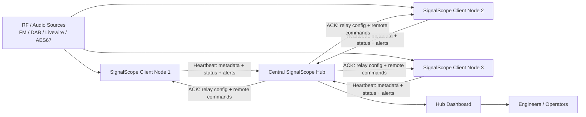

# SignalScope

SignalScope is a **web-based radio monitoring and signal analysis platform** designed for broadcast engineers and SDR enthusiasts.

It can ingest **FM, DAB and Livewire/AES67 audio streams**, analyse them in real time, and present the results in a modern web dashboard.
The system supports both **stand-alone monitoring nodes and distributed hub deployments** for network-wide signal monitoring.

SignalScope is written in **Python (Flask)** and designed to run easily on **Linux servers, VMs, and small systems like Raspberry Pi**.

---

## Quick Install

```bash
/bin/bash <(curl -fsSL https://raw.githubusercontent.com/itconor/SignalScope/main/install_signalscope.sh)
```

Or clone and run the installer:

```bash
git clone https://github.com/itconor/SignalScope.git
cd SignalScope
bash install_signalscope.sh
```

If you prefer to inspect the script first:

```bash
curl -O https://raw.githubusercontent.com/itconor/SignalScope/main/install_signalscope.sh
bash install_signalscope.sh
```

The installer will:

- Detect existing installations and offer to update in-place
- Install system dependencies (including `rtl-sdr`, `welle.io`, `libportaudio2`)
- Create the Python virtual environment and install required packages
- Configure the systemd service and self-healing watchdog
- Optionally configure NGINX as a reverse proxy with Let's Encrypt TLS
- Start SignalScope

Once complete, open `http://localhost:5000`. The setup wizard will guide you through the rest.


---

## Features Overview

| Category | What SignalScope does |
|---|---|
| **Inputs** | FM via RTL-SDR, DAB via RTL-SDR, Livewire/AES67 (RTP multicast), HTTP/HTTPS audio streams, local ALSA/PulseAudio devices |
| **FM Scanner** ⚠ | On-demand FM frequency tuning via RTL-SDR with live browser audio; hub scanner page (`/hub/scanner`); **early-stage feature** — audio streaming reliability is under active development |
| **Level & loudness** | dBFS level, LUFS Momentary/Short-term/Integrated (EBU R128), true peak |
| **Metadata** | RDS PS name, RDS RadioText, DAB service name, DAB DLS now-playing text, DAB ensemble/mode/bitrate/SNR |
| **Rule alerts** | Silence, clipping, hiss, LUFS true peak, LUFS integrated loudness |
| **Composite fault alerts** | STUDIO_FAULT, STL_FAULT, TX_DOWN (FM); DAB_AUDIO_FAULT, DAB_SERVICE_MISSING (DAB); RTP_FAULT (Livewire/AES67) |
| **Name mismatch alerts** | FM_RDS_MISMATCH, DAB_SERVICE_MISMATCH |
| **AI anomaly detection** | Per-stream ONNX autoencoder, 24 h learning phase, adaptive baseline, feedback-driven retraining (👍/👎 in Reports or Hub Reports) |
| **Broadcast Chains** | Visual signal path builder with fault location, node stacking, ad break handling, maintenance bypass, flap detection, chain health score, chain SLA, fault history with audio replay timeline, all-node clip capture, predictive level trend, shared fault detection, historical time-travel view |
| **Stream comparator** | Cross-correlate pre/post processing pairs; detect processor failure, gain drift, dropout |
| **Metric history** | SQLite time-series, 90-day retention, signal history charts (15+ metrics), availability timeline, trend analysis |
| **Notifications** | Email (SMTP), MS Teams Adaptive Cards, Pushover, plain text webhooks, alert escalation |
| **Hub mode** | Multi-site aggregation, site approval, remote source management, wall mode, hub reports |
| **PTP monitoring** | Offset, jitter, drift, grandmaster change detection; values logged to metric history |
| **SLA tracking** | Monthly per-stream uptime percentage; chain SLA tracking |
| **Security** | CSRF, PBKDF2-SHA256 passwords, HMAC+AES-256-GCM hub comms, session timeouts, rate limiting |
| **Backup & restore** | One-click ZIP backup of config, AI models, signal history DB, SLA data, alert log and hub state |

---

## Getting Started

### First Run

After installation, open `http://localhost:5000`. The setup wizard walks through:

1. **Authentication setup** — set an admin password
2. **SDR configuration** — detect and configure RTL-SDR dongles if present
3. **Hub configuration** — optionally configure this node as a hub client or hub server
4. **Monitoring settings** — silence threshold, alert cooldown, notification channels

After the wizard completes, the dashboard loads automatically.

### Adding Your First Input

1. Go to **Settings → Inputs** and click **+ Add Input**
2. Choose a source type, enter a name and device address (see the Inputs section below)
3. Save — monitoring starts within a few seconds

### Dashboard Overview

The dashboard shows a card for each monitored stream. Each card displays:

- Live level bar and dBFS reading
- LUFS Momentary/Short-term/Integrated values
- RDS Programme Service name and RadioText (FM), or DAB service name and DLS text (DAB)
- AI status badge (Learning / OK / Anomaly)
- Trend badge when level is notably above or below the expected range
- 24-hour availability timeline bar
- Alert/warning status strip on the card border
- Listen button for live audio in the browser — opens a sticky mini-player bar at the bottom of the page

Cards are drag-to-reorder. Alert cards sort to the top automatically.

---

## Inputs

### Source Types and Device Address Formats

| Source type | Address format | Example |
|---|---|---|
| FM via RTL-SDR | `fm://<frequency_MHz>` | `fm://96.3` |
| FM with specific dongle | `fm://<freq>?serial=<serial>&ppm=<offset>` | `fm://96.3?serial=00000001&ppm=-2` |
| DAB service | `dab://<ServiceName>?channel=<CH>` | `dab://Cool FM?channel=12D` |
| Livewire (multicast RTP) | `rtp://<multicast_address>:<port>` | `rtp://239.192.10.1:5004` |
| AES67 (RTP) | `rtp://<multicast_address>:<port>` | `rtp://239.69.0.1:5004` |
| HTTP/HTTPS audio stream | Full URL | `http://relay.example.com:8000/stream` |
| Local sound device | `sound://<device_index>` | `sound://2` |

### SDR Dongle Assignment

FM and DAB inputs require an **explicitly assigned RTL-SDR dongle serial**. Before adding an FM or DAB input:

1. Connect your RTL-SDR dongle(s) and go to **Settings → SDR Devices**
2. Click **Scan** — detected dongles are listed with their serial numbers
3. Assign a **Role** to each dongle (`fm`, `dab`, or `none` for general use)
4. Save

When adding an FM or DAB input, the dongle dropdown only shows devices assigned a compatible role. If no dongle is selected, the form will not submit. Inputs that are missing a dongle assignment will log "no dongle configured" and will not start monitoring until edited and a dongle is assigned.

### Adding FM Sources

1. In the Add Input form, select **FM**
2. Enter the frequency in MHz as the device address
3. Select the RTL-SDR dongle to use from the **Dongle** dropdown (register dongles in Settings → SDR Devices first)
4. Optionally set a PPM calibration offset
5. Save — SignalScope starts the RTL-SDR receiver and will begin reporting level, carrier strength, and RDS data

### Adding DAB Sources

1. Select **DAB** in the Add Input form
2. Select a DAB channel (e.g. `12D`) and click **🔍 Scan Mux** to enumerate all services on that multiplex
3. Select one or more services from the list and click **➕ Add Selected Services**
4. Each service is added with its broadcast name and the correct `dab://` address automatically

Multiple DAB services on the same multiplex share a single `welle-cli` process, started with elevated scheduling priority (`nice -10`) to maintain stability on ARM hardware.

### Adding Livewire / AES67 Sources

Enter the multicast RTP address and port as the device address. SignalScope joins the multicast group and measures RTP packet loss and jitter (RFC 3550 EWMA) in addition to audio levels.

### Adding Local Sound Devices

Select **Local Sound Device** — a drop-down is populated from the OS device list via `/api/sound_devices`. Select a device (microphone, line-in, USB audio, loopback) and save. The device index is stored as `sound://<index>`.

---

## FM Scanner ⚠ Early Stage

The FM Scanner (`/hub/scanner`) lets you tune any FM frequency on demand using an RTL-SDR dongle and listen to live audio in the browser — without permanently adding the frequency as a monitored input. It is useful for quick spot-checks of a frequency or for confirming RF coverage before adding a full monitored input.

> **⚠ Experimental**: The FM Scanner audio streaming pipeline is at an early stage of development. Audio quality and reliability are under active improvement. The pipeline routes `rtl_fm → ffmpeg → hub relay → browser` and involves timing-sensitive inter-process pipe synchronisation that may produce artefacts, drop-outs, or speed variations on some hardware or network configurations.

### Using the FM Scanner

1. On the Hub page, click **🔍 Scanner**
2. Enter an FM frequency in MHz
3. Click **Tune** — audio begins streaming to the browser mini-player after a 1–3 second start-up delay

The scanner releases the RTL-SDR dongle automatically when the session ends or the page is closed.

### Known Limitations (Early Stage)

- Audio may stutter, drop out, or run at slightly incorrect speed depending on hardware and system load
- End-to-end latency is typically 1–3 seconds from RF to browser
- Only one active scanner session per dongle; attempting to open a second session on the same dongle will fail silently
- The RTL-SDR dongle used for scanning must be registered in **Settings → SDR Devices** with a role of `fm` or `none`

---

## Alerting

### Alert Types

**Level alerts** (apply to all source types):

| Alert | Condition |
|---|---|
| `SILENCE` | Audio level falls below the configured silence floor |
| `CLIP` | Audio level reaches or exceeds the clip threshold (default −1.0 dBFS) |
| `HISS` | High-frequency noise floor detected above threshold |
| `LUFS_TP` | True peak exceeds configured dBTP threshold (default −1.0 dBTP) |
| `LUFS_I` | 30-second integrated loudness deviates from EBU R128 target (default −23 LUFS ± 3 LU) |

**Composite fault alerts** (silence is diagnosed automatically):

| Alert | Source | What it means |
|---|---|---|
| `STUDIO_FAULT` | FM | Silence + carrier present + RDS present → playout/studio failure |
| `STL_FAULT` | FM | Silence + carrier present + RDS absent → STL/link failure |
| `TX_DOWN` | FM | Silence + weak/no carrier + no RDS → transmitter or RF failure |
| `DAB_AUDIO_FAULT` | DAB | Silence + mux locked + SNR ≥ 5 dB → studio/playout fault |
| `DAB_SERVICE_MISSING` | DAB | Ensemble locked but configured service absent from mux |
| `RTP_FAULT` | Livewire/AES67 | Silence + ≥ 10% packet loss → network fault |

**Metadata mismatch alerts**:

| Alert | Condition |
|---|---|
| `FM_RDS_MISMATCH` | Received RDS PS name differs from configured expected name, or changes unexpectedly |
| `DAB_SERVICE_MISMATCH` | Received DAB service name differs from configured expected name, or changes unexpectedly |

**AI and chain alerts**:

| Alert | Condition |
|---|---|
| `AI_ANOMALY` | AI autoencoder reconstruction error exceeds learned threshold |
| `CMP_ALERT` | Post-processing stream silent while pre-processing stream has audio |
| `CHAIN_FAULT` | First down node identified in a broadcast chain |
| `CHAIN_RECOVERED` | Previously faulted chain returns to fully OK |
| `CHAIN_FLAPPING` | Chain has faulted and recovered 3+ times within 10 minutes |

### Setting Expected RDS / DAB Names

On any FM stream card, click **📌 Set** next to the live RDS PS name to pin it as the expected name. A ✓ indicator appears when the received name matches; ⚠ appears with the expected name on mismatch. Click **📌 Update** to re-pin to the current name.

The same 📌 Set button is available on DAB stream cards for the service name.

### Notification Channels

Configure notification channels in **Settings → Notifications**:

- **Email (SMTP)** — standard SMTP with TLS; per-alert subject and body
- **MS Teams** — Adaptive Card format with colour-coded severity; or plain text webhook
- **Pushover** — mobile push notifications with priority levels
- **Webhook** — generic HTTP POST with JSON payload; configurable URL and headers

All channels receive the same alert types. You can test each channel from the Settings page.

### Escalation

Set a per-stream escalation timeout (minutes) in stream settings. If an alert remains unacknowledged after that period, all configured notification channels fire again. Set to 0 to disable escalation.

### Alert Cooldown

A 60-second cooldown prevents duplicate notifications for the same alert type on the same stream. Alert history is always written regardless of cooldown state.

---

## Broadcast Chains

Broadcast Chains model the physical signal path of a service as an ordered sequence of monitoring points. The hub identifies the first failed point in the chain and fires a named alert, giving engineers a specific fault location rather than a generic silence notification.

Broadcast Chains are configured and viewed on the hub under **Hub → Broadcast Chains**.

### Creating a Chain

1. Click **+ New Chain** and give it a name (e.g. `Cool FM Distribution`)
2. Click **+ Add Node** for each point in the signal path, in order from source to destination:
   - **Site** — choose `This node (local)` for streams on the hub machine, or any connected remote site
   - **Stream** — populated from the selected site's available streams
   - **Label** — optional friendly name (e.g. `Manchester TX`); defaults to the stream name
   - **Machine tag** — optional server/hardware identifier (e.g. `LONCTAXZC03`); used for cross-chain shared fault correlation
3. Click **💾 Save Chain**

Example chain layouts:

**Studio → STL → Transmitter:**
```
[Studio Feed (local)] → [STL Monitor (Site: STL Node)] → [TX Air Monitor (Site: Manchester TX)]
```

**Multi-TX same service:**
```
[Cool FM DAB (Site: NI DAB Hub)] → [Cool FM FM Site 1 (Site: Manchester TX)] → [Cool FM FM Site 2 (Site: Liverpool TX)]
```

### Node Stacking

Place multiple streams at the same chain position to model parallel monitoring (e.g. FM Rx and DAB Rx both connected to the same transmitter output).

Click **+ Stack** within a position to add a second stream. Each stack has a **fault mode**:

- **Fault if ALL silent** — the position only faults when every stream in the stack is silent. Use this for redundant receivers: one surviving receiver means the transmitter is still on air.
- **ANY down = fault** — the position faults if any single stream in the stack goes silent. Use this for stricter monitoring where every path is required.

Each stack position also has an optional **Stack label** field that appears once two or more streams are added. Enter a descriptive name (e.g. `Primary Sources`, `STL Feeds`, `TX Monitors`). The label is used in fault alert messages, the live fault status line, the chain diagram, and the fault history log — replacing the generic "Stack" placeholder with a meaningful location name.

### Ad Break Handling

If upstream nodes legitimately go silent during ad breaks (because ad audio enters from a separate feed), mark the injection point as the **Ad mix-in point** in the chain builder. While that node carries audio, SignalScope treats upstream silence as an ad break and holds the fault alert.

Set a **Fault confirmation delay** (seconds) — the chain must remain in the faulted state for this entire window before the alert fires. Typical values: 90–180 s.

During the confirmation window:

- Faulted upstream nodes turn **amber** (not red)
- A badge shows **AD BREAK — 87s** with a live countdown
- The mix-in point node shows a **🔀 Mix-in — playing** marker
- Nodes downstream of the mix-in remain green

If the mix-in point itself goes silent mid-countdown, the confirmation timer is bypassed and the alert fires immediately.

Ad break handling also applies to **"fault if ALL silent" stacks** without a mix-in node: if every stream in the stack goes silent simultaneously, the position is treated as an ad break candidate and gets the same confirmation window and AD BREAK badge behaviour.

**SLA and health score**: ad break confirmation-window periods are never counted as downtime. If an ad break exceeds the configured delay and a `CHAIN_FAULT` notification fires, that event is tagged as an adbreak overshoot and is also excluded from both the SLA downtime counter and the chain health score's fault-frequency component — so repeated long ad breaks cannot degrade a chain's health score or uptime percentage.

### Flap Detection

If a chain faults and recovers 3 or more times within a 10-minute window, SignalScope fires a `CHAIN_FLAPPING` alert instead of continued individual FAULT/RECOVERED notifications. Flapping is indicated on the chain view with an amber status badge. This typically indicates an intermittent connection or borderline RF signal rather than a hard failure.

### Node Maintenance Bypass

Mark any node as **In Maintenance** to exclude it from fault detection without removing it from the chain. The node displays a maintenance badge and is skipped during chain evaluation until the timer expires. Useful when planned work on a single point would otherwise trigger false chain alerts.

To set maintenance mode, click the 🔧 button that appears on any chain node. A popover offers duration presets — **30 min / 1 h / 2 h / 4 h** — and a **✕ Clear** option to cancel early. The node immediately turns blue and shows a **🔧 Maint until HH:MM** badge while active. Works on both single-stream nodes and nodes inside stacks.

### Per-Node Silence Threshold Override

The chain builder includes a **Silence dBFS override** field on each stream row. When set, this value replaces the stream's own configured silence threshold when evaluating that specific node — within that chain only.

This is useful when the same physical stream appears in multiple chains that have different expectations. For example, a transmitter monitor at −28 dBFS might be considered audio-present in a transmitter chain (carrier is active) but should trigger a silence fault in a downstream distribution chain (where −28 dBFS is noise floor). Set the override in the distribution chain's node row to e.g. `−35`; the stream's original threshold is unchanged everywhere else.

### Chain Health Score

Each chain card displays a live **health score from 0 to 100**, calculated from five components:

| Component | Weight | Detail |
|---|---|---|
| 30-day SLA | 0–70 pts | Primary long-run driver; 100 % SLA = 70 pts |
| Fault frequency (last 7 d) | 0–20 pts | Starts at 20; −4 pts per genuine fault this week |
| Stability | 0–10 pts | Full 10 pts when not flapping; 0 when flapping |
| Trending-down nodes | −5 per node | Max −15 penalty for nodes with falling levels |
| RTP packet loss | 0 to −10 pts | Peak loss across all RTP nodes; −1 pt per 1% loss, capped at −10 |

Non-RTP streams (FM, DAB, HTTP, local sound) are excluded from the RTP component. Ad-break overshoot faults (confirmation window timed out during a long ad break) are excluded from the fault-frequency count and do not accumulate SLA downtime.

Colour-coded labels: **Healthy** (≥ 90) · **Watch** (75–89) · **Degraded** (50–74) · **Poor** (< 50). Hover the badge for a tooltip showing the score breakdown, including the RTP loss figure when non-zero. A newly-created chain starts around 65 and improves as SLA history accumulates.

### Chain SLA

Each chain accumulates an uptime percentage based on how long it has been in a confirmed-fault state versus monitored time. The SLA is displayed on the chain status view and updated once per minute. Ad break countdown periods and maintenance bypass periods are excluded from downtime — only confirmed faults count against the SLA.

### Fault History Log

Each chain maintains a rolling fault event log showing the last 50 fault/recovery transitions with timestamps, fault node details, duration, and captured audio clips. View it by expanding the **📋 Fault History** panel on the Broadcast Chains page.

### Predictive Level Trend Warning

SignalScope monitors the level trend for each node over the last 60 minutes. If level is falling at ≥ 0.3 dBFS/min (linear regression slope), the node shows a **📉 Falling** trend indicator before silence actually occurs. This gives engineers early warning of a degrading input — for example a transmitter slowly losing power or an IP feed with increasing congestion.

### Shared Fault Detection

When a chain fault fires, SignalScope checks whether the faulted node's hardware appears in any other chain and includes a note in the alert message:

> `NOTE: other chains share hardware 'LONCTAXZC03': Cool FM Distribution, Absolute Radio Chain`

This helps engineers immediately understand whether a fault is isolated to one chain or affects multiple services sharing the same server or hardware. Correlation priority:

1. **Machine tag** (explicit, most reliable) — set in the chain builder node form
2. **Hub site name** — streams from the same remote site are assumed to share hardware
3. **Local stream name** — exact name match for local streams

### Historical Chain View (Time Travel)

The Broadcast Chains page includes a **📅 View History** picker. Select any past date and time to reconstruct how the chain appeared at that moment, using stored metric history. This is useful for post-incident review: see exactly which node was down and when, without relying on alert logs alone.

Historical state is reconstructed from `metrics_history.db` — data is available for the retention window (default 90 days). Nodes with no data in a ±10-minute window around the selected time are shown as **Unknown**.

### Signal Comparators on Chains

Add correlation comparators between any two positions to measure how well the signal tracks across that section of the chain.

- Click **+ Add Comparator** and select any two positions
- **↔ Add End-to-End** adds a comparator from position 0 to the last position in one click
- Correlation is computed as Pearson r over the last 10 minutes of metric history (requires ≥ 5 minutes of shared data)
- Results shown as colour-coded chips:
  - 🟢 ≥ 80% — good correlation
  - 🟡 50–79% — moderate (check for processing delay or dropout)
  - 🔴 < 50% — poor (potential fault or mismatch)

### Click-to-Listen

Click any node bubble on the Broadcast Chains page to start live audio monitoring from that point. A sticky mini-player bar appears at the bottom of the viewport showing the stream name, site, chain name, native audio controls, and an ⏹ Stop & close button. A pulsing blue ring on the node indicates the active stream. Click the same node again, click a different node (switching streams automatically), or press Stop & close to end playback. Stack sub-nodes each have their own listen URL.

### Chain Fault Alerts

When a chain transitions from OK to fault, SignalScope sends a `CHAIN_FAULT` notification through all configured channels. The message names the exact fault node, its site, any shared hardware across other chains, and how many downstream nodes may be affected.

When a chain returns to fully OK, a `CHAIN_RECOVERED` notification fires.

When a chain is flapping (repeated fault/recovery), a single `CHAIN_FLAPPING` alert fires in place of continued individual fault/recovery notifications.

When a stream is part of a chain, the CHAIN_FAULT notification takes priority: individual stream silence alerts are still logged to alert history but push notifications for those streams are suppressed, preventing alert storms.

Audio evidence clips are saved for **every node** in the chain at the moment of fault — not just the fault point and last-good node. Each clip is tagged with the node label and chain position. Remote node clips are automatically uploaded to the hub and back-patched into the fault log entry.

In the **Fault History** panel, any fault entry with captured clips shows a **🎬 Replay** button. Clicking it opens an inline replay timeline: node clips are laid out left-to-right in signal-path order (matching the chain diagram), colour-coded by fault status. **▶ Play All** plays through all clips sequentially with the active node highlighted. Individual ⬇ download links are provided per clip.

---

## Hub Mode

SignalScope can operate as a central hub receiving data from multiple monitoring client nodes.

### Setting Up a Hub

Enable hub mode in **Settings → Hub**. Set a hub secret key — all client nodes must use the same key to connect.

Client nodes connect to the hub by configuring the hub URL and secret in their own **Settings → Hub** page.

### Site Approval

New client connections wait in a **Pending Approval** state until a hub admin clicks **✓ Approve** on the hub dashboard. This prevents unauthorised nodes from feeding data to the hub. Client nodes running an outdated build are flagged with an **⚠ Update Required** banner.

Sites persist until explicitly removed via the **✕ Remove** button — they are never pruned automatically, regardless of how long they have been offline.

### Remote Management

From the hub dashboard, operators can:

- **Start/stop monitoring** on any client node without logging into that node
- **Add or remove sources** on any client — FM, DAB, RTP, and HTTP sources can be added remotely, including a full DAB scan-and-bulk-add workflow
- **View hub reports** — aggregated alert history, audio clips, and SLA data from all connected sites

### Hub Notification Delegation

Configure a client node to suppress its own notifications and delegate all alerting to the hub. The hub can then apply per-site forwarding rules — enabling or disabling specific alert types per site — before sending notifications. Deduplication by event UUID prevents duplicate notifications when a client reconnects.

### Wall Mode

Open `/hub?wall=1` (or click **Wall Mode** on the hub dashboard) for a purpose-built large-screen display:

- **Header bar** — live clock, summary pills (Alerts / Warnings / Sites Offline / All OK)
- **Connected Sites strip** — one colour-coded pill per site (green/amber/red/grey) with alert/warn count
- **Broadcast Chains panel** — all chains as horizontal rows; fault node marked **FAULT POINT**; updates every 15 seconds via AJAX
- **Stream Status grid** — every stream from every site in a unified grid, sorted alerts-first

The page auto-refreshes every 60 seconds to pick up new streams or sites.

### Hub Reports

Hub Reports shows a consolidated alert timeline across all sites, with:

- Summary cards for each alert type with click-to-filter
- Chain column showing which broadcast chain each event belongs to
- Audio clip playback via a sticky mini-player bar (stream name, timestamp, native audio controls, ⬇ Download, ✕ close) — clips are auto-downloaded from clients as they are created and served locally by the hub, so playback has no dependency on the client being online
- SLA data per stream
- 👍 / 👎 AI feedback buttons on every `AI_ALERT` / `AI_WARN` row — labels are forwarded to the originating client so its model retrains without requiring direct access to that node

### Architecture



Each client monitors local RF or IP audio sources and reports status, metadata, and alert data to the hub via HMAC-signed, AES-256-GCM encrypted heartbeats. The hub issues commands back to clients on heartbeat ACKs.

In hub mode, the hub accumulates metric history for all remote sites from heartbeat data — a hub-only machine with no local streams still builds full signal history charts for all connected sites.

---

## Mobile API & iOS App

SignalScope includes a mobile API (`/api/mobile/*`) for companion iOS app integration.

### Authentication

All mobile API endpoints require a Bearer token (or `X-API-Key` header / `?token=` query parameter). Generate or rotate the token in **Settings → Mobile API**.

### Key Mobile API Endpoints

| Endpoint | Method | Description |
|---|---|---|
| `/api/mobile/status` | GET | All monitored streams with live metrics and AI status |
| `/api/mobile/faults` | GET | Active fault chains |
| `/api/mobile/reports/events` | GET | Alert event history; supports `limit=` and `before=` (Unix timestamp cursor) for pagination |
| `/api/mobile/metrics/history` | GET | Time-series metric data for a stream; params: `stream` (required), `metric` (default `level_dbfs`), `hours` (1/6/24, default 6), `site` (hub mode) |
| `/api/mobile/hub/overview` | GET | Hub sites summary with per-site stream list, alert counts, and latency |
| `/api/mobile/register_token` | POST | Register an APNs device token for push notifications |

### iOS App Features

- **Dashboard** — live stream cards with level bars, LUFS, AI status, and alert badges; pull-to-refresh; push notifications for active faults
- **Active Faults** — list of active fault chains with age, SLA, and acknowledgement; deep-link from push notification taps
- **Reports** — paginated alert event history with search, site/type filters, clips-only toggle, and **Load More** cursor-based pagination (100 events per page)
- **Hub Overview** — sites list with expandable stream rows showing RDS PS name / DAB service name in brand-blue, now-playing / DLS text, format badge, SLA, and RTP loss label; tap any stream row to open its **Signal History** chart
- **Signal History** — full-screen chart (Swift Charts) for any stream; select time range (1 h / 6 h / 24 h) and metric (Level dBFS, LUFS Momentary, LUFS Integrated, RTP Loss %, RTP Jitter ms, FM Signal dBm, FM SNR dB, DAB SNR); min / avg / max stats shown below the chart
- **Audio playback** — AVPlayer for both live streams and fault audio clips; clip playback with preparing / loading state

### Push Notifications (APNs)

Configure push notifications in **Settings → Mobile API → Push Notifications**:

| Field | Description |
|---|---|
| **APNs Key ID** | 10-character key ID from your Apple Developer account |
| **Team ID** | 10-character Apple Developer Team ID |
| **Bundle ID** | App bundle identifier (e.g. `com.example.SignalScope`) |
| **APNs `.p8` Private Key** | Full contents of the downloaded `.p8` key file |
| **Sandbox mode** | Enable for development/Xcode builds; disable for TestFlight and App Store |

Device tokens are registered automatically by the iOS app on first launch. Multiple tokens are stored with their environment flag (sandbox/production) so each device receives pushes from the correct APNs endpoint. Push notifications are sent for `CHAIN_FAULT`, `SILENCE`, and other configured alert types.

---

## Metric History & Analytics

### SQLite History

SignalScope writes per-stream metrics to `metrics_history.db` (SQLite) once per minute. No additional Python dependencies are required. The database is created automatically on first start.

Metrics stored per stream:

| Metric | Streams | Description |
|---|---|---|
| `level_dbfs` | All | Audio level in dBFS |
| `lufs_m`, `lufs_s`, `lufs_i` | All | LUFS Momentary, Short-term, Integrated |
| `silence_flag` | All | 1.0 = currently silent (at or below threshold), 0.0 = audio present |
| `clip_count` | All | Clipping events per snapshot window |
| `fm_signal_dbm` | FM | RF carrier strength |
| `fm_snr_db` | FM | Signal-to-noise ratio |
| `fm_stereo` | FM | 1.0 = stereo pilot present, 0.0 = mono |
| `fm_rds_ok` | FM | 1.0 = RDS lock confirmed, 0.0 = no lock |
| `dab_snr` | DAB | DAB signal-to-noise ratio |
| `dab_ok` | DAB | 1.0 = service present in ensemble |
| `dab_sig` | DAB | DAB signal level dBm |
| `dab_bitrate` | DAB | Service bitrate in kbps |
| `rtp_loss_pct` | RTP/AES67 | Packet loss percentage |
| `rtp_jitter_ms` | RTP/AES67 | Jitter (RFC 3550 EWMA) in milliseconds |
| `ptp_offset_us` | PTP | Clock offset in microseconds (keyed `ptp/local` or `ptp/<site>`) |
| `ptp_jitter_us` | PTP | PTP jitter in microseconds |
| `ptp_drift_us` | PTP | PTP drift in microseconds |
| `chain_status` | Chains | 1.0 = OK, 0.0 = faulted (keyed `chain/<id>`) |
| `health_pct` | Hub sites | Heartbeat success rate % (keyed `site/<name>`) |
| `latency_ms` | Hub sites | Round-trip heartbeat latency in milliseconds |

Data older than 90 days is pruned automatically once per day.

### Signal History Charts

Click **📈 Signal History** on any stream card to expand a canvas-rendered chart. Select a time range (1 h / 6 h / 24 h) and a metric from the dropdown — all applicable metrics for the stream type are listed. When viewing Level dBFS, a dashed reference line and shaded band shows the expected level range for the current hour (see Trend Analysis).

### Availability Timeline

A colour-coded timeline bar sits below the level bar on every stream card:

- 🟢 Green — signal present
- 🔴 Red — silence / audio floor
- 🟡 Amber — DAB service missing (ensemble locked, service absent)
- ⬛ Dark — no data

Click the bar to cycle between 24 h, 1 h, and 6 h views.

### Trend Analysis

SignalScope builds an hour-of-day baseline (14-day rolling) and a day-of-week baseline (28-day rolling, 168 buckets). When the current level deviates more than ±1.5σ from the expected range, the stream card shows a trend badge:

- `📉 Lower than usual (−2.1σ)` — amber
- `📈 Higher than usual (+1.7σ)` — blue
- When sustained for ≥ 10 consecutive minutes, the badge escalates to red and shows duration: `📉 Lower than usual (−2.3σ, 14 min)`

The badge shows a `·dow` suffix when the day-of-week model is active.

Trend data is available via the API at `/api/trend/<stream>`.

---

## AI Anomaly Detection

Each stream has its own ONNX autoencoder model trained on 14 audio features extracted from the 48 kHz / 24k-sample chunks:

- **Learning phase** — the model trains continuously for 24 hours after a stream is added. During this period the stream card shows a **Learning** badge and no anomaly alerts are raised.
- **Detection** — after the learning phase, the autoencoder reconstruction error is compared to a learned baseline. Scores that consistently exceed the learned threshold (3 consecutive 5-second windows) trigger an `AI_ALERT` or `AI_WARN`.
- **Adaptive baseline** — on clean (non-anomalous) windows, the reconstruction error mean and standard deviation are updated continuously using an exponential moving average, so the model naturally tracks slow long-term changes in a stream's normal characteristics without needing manual retraining.
- **Models are stored** in `ai_models/` and persist across restarts. They are included in the backup ZIP.

### Feedback-Driven Retraining

After the 24 h learning phase, you can teach the model directly from real alert events:

- In **Reports**, each `AI_ALERT` and `AI_WARN` row shows a 👍 / 👎 button
  - 👍 **False alarm** — the flagged audio was actually normal (e.g. jingles, sweepers, silence fills). The clip's audio features are extracted and added to the stream's clean buffer. The alert threshold is temporarily raised so the same content no longer triggers until the model is retrained.
  - 👎 **Confirmed fault** — the alert was correct. No feature injection; threshold nudged slightly lower.
- After **5 false-alarm labels**, a background retrain is triggered automatically. The retrain uses the **full original 24 h training corpus** (saved to `ai_models/<stream>_initial.npy` after the initial phase) combined with all clean buffer samples and labeled clips. The model is trained from scratch on the complete dataset — no knowledge is lost.
- After retraining, the temporary threshold bias resets to zero because the corrected understanding is now baked into the model weights.
- **From the Hub**: the Hub Reports page shows the same 👍/👎 buttons on every AI event row. Clicking sends the label to the hub, which stores it locally and forwards it to the relevant client as a command delivered on the next heartbeat (≈ 5 s). The retrain happens on the client where the audio data lives. If the client is offline, the command is queued and delivered on reconnect.

AI analysis runs every 5 seconds on each stream, independently of the rule-based alert checks.

---

## Stream Comparator

Pair two streams as PRE and POST to monitor signal integrity through a processing chain (e.g. studio feed vs. on-air monitor, or pre-processor vs. post-processor):

- SignalScope cross-correlates the two streams to measure processing delay
- **CMP_ALERT** fires when the post-processing stream goes silent while the pre-processing stream has audio — indicating processor failure rather than a content silence
- Gain drift alerts fire when the level difference between pre and post exceeds a threshold, indicating compressor or AGC issues
- Single-path RTP dropout is distinguished from full processing chain failure

Configure comparator pairs in **Settings → Comparators**. PRE / POST badges appear on stream cards in the comparator role. Status and measured processing delay are shown on the dashboard.

---

## SLA Tracking

SignalScope tracks monthly per-stream uptime as a percentage. A stream is counted as available for any minute in which its audio level is above the silence floor.

Broadcast Chains also have their own SLA tracking — a chain is counted as down only when it has transitioned to a confirmed-fault state. Ad break countdown periods and maintenance bypass periods do not count as downtime.

SLA data is stored in `sla_data.json` and displayed per stream in Hub Reports.

---

## Security

- **Authentication** — PBKDF2-SHA256 password hashing, session timeouts, and login rate limiting
- **CSRF protection** — all state-changing routes require a valid CSRF token
- **Hub communication** — HMAC-SHA256 signing, AES-256-GCM payload encryption, 30-second replay protection window, 60 RPM rate limiting per client
- **Path traversal protection** — all file-serving routes validate paths against the snippet directory boundary
- **SDR API** — DAB channel parameter validated against an explicit allowlist; PPM offset validated as a signed integer within ±1000; SDR scan endpoints require authentication
- **Secret key** — Flask secret key file created with `0o600` permissions

---

## Supported Hardware

| SDR Hardware | Supported |
|---|---|
| RTL-SDR Blog V3 | Yes |
| RTL-SDR Blog V4 | Yes |
| Generic RTL2832U dongles | Yes |

| Input Type | Supported |
|---|---|
| RTL-SDR FM | Yes |
| DAB via RTL-SDR | Yes |
| Livewire / AES67 streams | Yes |
| HTTP/HTTPS audio streams | Yes |
| Local ALSA/PulseAudio devices | Yes |

---

## Watchdog

The installer configures a systemd watchdog timer that runs every minute and independently monitors:

- **SignalScope app** on port 5000 — restarts the `signalscope` service if unresponsive
- **NGINX** on ports 443/80 — restarts nginx if configured and unresponsive

Each service is monitored and restarted independently. Watchdog events are visible in the system journal:

```bash
journalctl -t signalscope-watchdog
```

---

## Backup & Migration

One-click backup is available in **Settings → Maintenance → Backup & Restore**. This downloads a timestamped ZIP (`signalscope_backup_YYYYMMDD_HHMMSS.zip`) containing everything needed to fully restore or migrate an installation:

| File | Contents |
|---|---|
| `lwai_config.json` | All configuration and stream settings |
| `ai_models/` | Trained ONNX autoencoder models, baseline stats, feedback state, and preserved 24 h training corpora (`_initial.npy`) used for retraining |
| `metrics_history.db` | Signal history database (90 days of per-stream metrics) |
| `sla_data.json` | SLA uptime records |
| `alert_log.json` | Full alert event history |
| `hub_state.json` | Hub site registrations and connection state |

The metrics database is snapshotted cleanly using SQLite's built-in backup API, so the file is always consistent even if SignalScope is actively writing at the time.

To restore, upload the ZIP via **Settings → Maintenance → Restore from Backup**. Config, AI models, metrics history, SLA data, alert log and hub state are all restored and monitoring restarts automatically.

To migrate to a new machine: install SignalScope on the target, upload the backup ZIP via the restore page, and monitoring will restart with the full history and configuration intact.

In-app self-update is available in **Settings → Maintenance**. The **Apply Update & Restart** button checks GitHub for a newer version and, on confirmation, downloads the new `signalscope.py`, validates it with `py_compile`, replaces the running file, and sends SIGTERM — the systemd service and watchdog handle the restart automatically.

---

## Contributing

Pull requests and suggestions are welcome. If you encounter issues, please open a GitHub issue.

---

## License

MIT License

---

## Changelog

See [CHANGELOG.md](CHANGELOG.md) for full version history.
