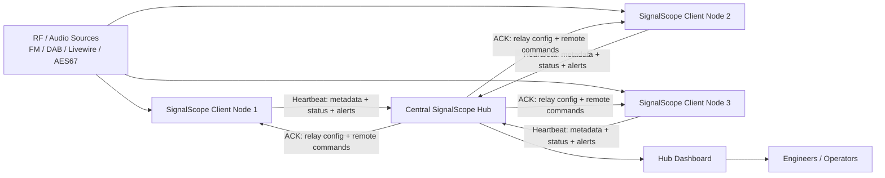

# SignalScope

SignalScope is a **web-based radio monitoring and signal analysis platform** designed for broadcast engineers and SDR enthusiasts.

It can ingest **FM, DAB and Livewire/AES67 audio streams**, analyse them in real time, and present the results in a modern web dashboard.
The system supports both **stand-alone monitoring nodes and distributed hub deployments** for network-wide signal monitoring.

SignalScope is written in **Python (Flask)** and designed to run easily on **Linux servers, VMs, and small systems like Raspberry Pi**.

---

## Install in 30 seconds

```bash
/bin/bash <(curl -fsSL https://raw.githubusercontent.com/itconor/SignalScope/main/install_signalscope.sh)
```

---

# 🚀 Quick Install

Clone the repository and run the installer:

```bash
git clone https://github.com/itconor/SignalScope.git
cd SignalScope
bash install_signalscope.sh
```

The installer will:

- Detect existing installations and offer to update in-place
- Install system dependencies
- Create the Python virtual environment
- Install required Python packages
- Configure the systemd service and self-healing watchdog
- Optionally configure NGINX as a reverse proxy
- Start SignalScope

Once complete, open:

```text
http://localhost:5000
```

The setup wizard will guide you through the rest.

---

# ⚡ One-Line Install

You can also install SignalScope directly using `curl`:

```bash
curl -sSL https://raw.githubusercontent.com/itconor/SignalScope/main/install_signalscope.sh | bash
```

### Optional safer version

If you prefer to inspect the script first:

```bash
curl -O https://raw.githubusercontent.com/itconor/SignalScope/main/install_signalscope.sh
bash install_signalscope.sh
```

---

# ✨ What's New in 3.2.0 — Wall Mode, RDS/DAB Name Alerting & Broadcast Chain Improvements

## Hub Wall Mode — Complete Redesign

Wall mode (`/hub?wall=1`) is now a purpose-built wall board display rather than a CSS-enlarged version of the hub dashboard.

**What it shows:**

- **Header bar** — live clock (ticking every second), summary pills (⚠ Alerts / ⚡ Warnings / ✗ Sites Offline / ✓ All Systems OK), Exit Wall Mode link
- **Connected Sites strip** — one colour-coded pill per connected site: 🟢 green = OK, 🟡 amber = warnings, 🔴 red = alerts or offline, ⬜ grey = offline; alert/warn count shown on the pill
- **Broadcast Chains panel** — every configured chain shown as a horizontal row of colour-coded nodes with arrows; fault node marked **FAULT POINT**, downstream nodes greyed out; chain status badge (ALL OK / FAULT) at the right; updates every 15 seconds via AJAX without page reload
- **Stream Status grid** — every stream from every site in one unified grid, colour-coded border (green/amber/red/grey), level bar, device type badge (DAB/FM/LW), RDS PS or DAB service name, Signal Lost / Offline label when down; sorted alerts-first
- Page auto-refreshes every 60 seconds to pick up newly added streams or sites

## RDS Programme Service Name Alerting

Alert when the station name received on an FM stream does not match what is expected.

**Two modes:**
- **Expected name set** — fires `FM_RDS_MISMATCH` when the received RDS PS name differs from the configured expected name (e.g. wrong station on the feed)
- **No expected name** — fires `FM_RDS_MISMATCH` when the name changes from what was previously seen (unexpected format change or wrong feed)

**📌 Set button on hub** — next to the live RDS PS name on each FM stream card, a **📌 Set** button pins the current live name as the expected name without typing anything. A ✓ indicator replaces the button when the name matches; a ⚠ indicator with the expected name shows when there is a mismatch. An **📌 Update** button lets you re-pin to the new name in one click.

Alert type: `FM_RDS_MISMATCH` — included in all notification channels and hub forwarding rules.

## DAB Service Name Alerting

Same capability for DAB streams — alert when the service name received from the mux does not match expected.

**📌 Set button on hub** — same one-click pinning on each DAB stream card. Shows ✓ when matching, ⚠ when mismatched.

Alert type: `DAB_SERVICE_MISMATCH` — included in all notification channels and hub forwarding rules.

## Broadcast Chains — Design & UX Improvements

- **Chains page redesign** — now fully matches the hub/dashboard visual design: same CSS variables, background watermark, `border-radius:14px` cards with box-shadow, `border-left:4px` status strip, matching button styles
- **Card status colouring** — chain cards now update their left border colour live (green = OK, red = FAULT, grey = unknown) as the chain status changes, matching the hub site card pattern
- **Edit and Delete buttons fixed** — were silently blocked by CSP; moved to `data-*` attributes with delegated event listeners
- **Header layout fixed** — logo, version, and nav now render correctly on one line

## DAB Mux Startup Reliability

- **Service count stabilisation** — `_poll_mux` now waits for the service count to be **identical across two consecutive 5-second polls** before announcing the mux as ready, rather than announcing on the first non-empty batch. Prevents monitoring threads from starting before welle-cli has finished enumerating all services on large multiplexes
- **Service lookup deadline extended** — the per-stream service lookup window after mux-ready has been increased from 8 to 20 seconds, accommodating services that take longer to appear on some hardware

---

# ✨ What's New in 3.1.0 — Phase 3 (Broadcast Chains, Extended Alerts & Local Audio Input)

## Broadcast Signal Chains

A new **Broadcast Chains** page (hub-only) lets you model the physical signal path of any service as an ordered chain of monitoring points — from studio through STL, transmitter sites, and DAB mux — and immediately see where a fault has occurred.

### What it does

- **Visual chain diagram** — each node is a live status box; green = audio present, red = fault, grey = site offline, amber = unknown
- **Fault location** — the hub walks the chain left to right; the first node that is down or offline is identified as the fault point and marked with a **⚠ Fault here** badge
- **Downstream suppression** — nodes after the fault point are greyed out; a fault upstream means their status is indeterminate
- **Live level display** — each node shows the current dBFS level, refreshed every 5 seconds via AJAX without a page reload
- **CHAIN_FAULT alert** — fires through all configured notification channels (email, Teams, Pushover, webhooks) when a chain transitions from OK to fault; subject line is `CHAIN FAULT — <chain name>`, body names the exact fault node, site, and stream
- **CHAIN RECOVERED alert** — fires when a faulted chain returns to fully OK, so you know when the issue has resolved without checking the dashboard
- **Hub site rules** — `CHAIN_FAULT` is included in the default forwarding types; you can enable/disable it per-site in hub settings like any other alert type

### Setting up a chain

1. Go to **Hub → Broadcast Chains** in the top navigation
2. Click **+ New Chain**
3. Give the chain a name, e.g. `Cool FM Distribution`
4. Click **+ Add Node** for each point in the signal path:
   - **Site dropdown** — choose `This node (local)` for streams running on the hub machine itself, or any connected remote site by name
   - **Stream dropdown** — populated automatically from the selected site's available streams
   - **Label field** — optional friendly name shown on the node box, e.g. `Manchester TX`; defaults to the stream name if left blank
5. Nodes are ordered left to right — add them in signal flow order (source first, destinations last)
6. Click **💾 Save Chain**

### Example chain layouts

**Studio → STL → Transmitter:**
```
[Studio Feed (local)] → [STL Monitor (Site: STL Node)] → [TX Air Monitor (Site: Manchester TX)]
```
If the STL monitor goes down but the Studio Feed is healthy, the fault marker appears on the STL node — pointing directly at the STL link rather than requiring you to check each site manually.

**Multi-TX same service:**
```
[Cool FM DAB (Site: NI DAB Hub)] → [Cool FM FM Site 1 (Site: Manchester TX)] → [Cool FM FM Site 2 (Site: Liverpool TX)]
```
If Site 1 is up but Site 2 goes silent, the chain shows fault at `Liverpool TX` — you get a named TX site in the alert rather than a generic silence notification.

**DAB mux chain:**
```
[Studio Playout (local)] → [DAB Mux Input (Site: Mux Node)] → [Cool FM DAB (Site: NI DAB Hub)] → [Downtown Country DAB (Site: NI DAB Hub)]
```

### Alert example

When a fault is detected you will receive:

> **Subject:** `CHAIN FAULT — Cool FM Distribution`
> **Body:** `Chain fault in 'Cool FM Distribution' — fault at 'Manchester TX' (site: Manchester TX, stream: Cool FM FM)`

When the chain recovers:

> **Subject:** `CHAIN RECOVERED — Cool FM Distribution`
> **Body:** `Chain 'Cool FM Distribution' has recovered — all nodes OK.`

### Fault detection logic

A node is considered **down** if:
- Its stream's audio level is ≤ −55 dBFS (silence floor), **or**
- It is a DAB stream and `dab_ok` is false (service missing from ensemble)

A node is **offline** if its site has not sent a heartbeat within the site timeout window.

Chains are evaluated every **30 seconds** by a background thread on the hub. A `CHAIN_FAULT` alert fires on the OK → fault transition only (not repeatedly while the fault persists), and a `CHAIN RECOVERED` alert fires on the fault → OK transition.

---

# ✨ What's New in 3.1.0 — Phase 3 (Extended Alerts & Local Audio Input)

## Composite Alert Classification — DAB & RTP

The silence alert classification introduced in 3.0 for FM sources now extends to DAB and RTP/Livewire:

- **DAB_AUDIO_FAULT** — fires when a DAB stream goes silent while the mux is locked and SNR is healthy (≥ 5 dB); indicates a studio or playout fault on that service rather than an RF or receiver problem
- **RTP_FAULT** — fires when a Livewire/AES67 stream goes silent with ≥ 10% concurrent packet loss; distinguishes a network fault from a genuine content silence
- Both alert types are included in `_HUB_DEFAULT_FORWARD_TYPES` and the hub site rules checkbox list, so they propagate through the hub to email/Teams/Pushover exactly like FM composite faults

Full composite alert matrix:

| Alert | Source | Condition |
|---|---|---|
| `STUDIO_FAULT` | FM | Silence + carrier + RDS present → playout failure |
| `STL_FAULT` | FM | Silence + carrier healthy but RDS absent → STL/link failure |
| `TX_DOWN` | FM | Silence + weak/no carrier + no RDS → transmitter/RF failure |
| `DAB_SERVICE_MISSING` | DAB | Ensemble locked but service gone from mux |
| `DAB_AUDIO_FAULT` | DAB | Silence + mux locked + SNR ≥ 5 dB → studio/playout fault |
| `RTP_FAULT` | Livewire/AES67 | Silence + ≥ 10% packet loss → network fault |

## Local Sound Device Input (ALSA/PulseAudio)

- **New input type** — "Local Sound Device" added to the Add Input form alongside Livewire/RTP/HTTP, DAB, and FM
- **Device picker** — clicking the type reveals a drop-down populated from `/api/sound_devices`; a Refresh button re-queries the OS at any time
- **ALSA/PulseAudio support** — captures from any input device (microphone, line-in, USB audio, loopback) via the `sounddevice` Python library (PortAudio backend)
- **Address format** — stored as `sound://<device_index>` (e.g. `sound://2`); device index is an integer from the OS device list
- **Full pipeline** — captured audio feeds into the same `analyse_chunk()` pipeline as all other source types: level, LUFS, AI, silence/clip/hiss alerts, SLA tracking
- **Installer** — `libportaudio2` added to the apt package list (installed on both fresh installs and updates); `sounddevice` added to the pip install line

## Extended Trend Analysis

- **Day-of-week baseline** — in addition to the hour-of-day baseline, trend analysis now builds a 168-bucket (day × hour) model from 28 days of history; used when a bucket has ≥ 10 samples, otherwise falls back to the 14-day hour-only baseline
- **Sustained deviation scoring** — the trend badge escalates from amber to red when a stream has been continuously above or below the ±1.5σ band for ≥ 10 consecutive minutes; duration shown in the badge (e.g. `📉 Lower than usual (−2.3σ, 14 min)`)
- **Baseline type indicator** — badge shows `·dow` suffix when the day-of-week model is active
- **API** — `/api/trend/<stream>` returns `baseline_type` (`dow_hour` or `hour`), `sustained_minutes`, and the full 168-bucket baseline table

---

# ✨ What's New in 3.1.0 — Phase 2 (Metric History & Trend Analysis)

## SQLite Metric History
- **`metrics_history.db`** — a local SQLite database is created automatically on first start (no migration needed for existing installs); no new Python dependencies (`sqlite3` is built-in)
- **Per-stream time-series storage** — `level_dbfs`, `lufs_m/s/i`, `fm_signal_dbm`, `dab_snr`, `dab_ok`, `rtp_loss_pct`, and `rtp_jitter_ms` are written once per minute per stream
- **Hub aggregation** — hub-mode nodes write metrics for all connected remote sites on every approved heartbeat (keyed as `SiteName/StreamName`), so a hub-only machine with no local streams still accumulates full history
- **90-day rolling retention** — rows older than 90 days are pruned automatically once per day; configurable via `METRICS_RETENTION_DAYS`

## Signal History Charts
- **📈 Signal History** — collapsible chart on every stream card in the hub dashboard and replica page; lazy-loaded when opened, no page refresh required
- **Range selector** — 1 h / 6 h / 24 h buttons reload the chart without a page reload
- **Metric selector** — Level dBFS, FM Signal dBm, DAB SNR, LUFS Momentary / Short-term / Integrated, RTP Jitter; only metrics relevant to the stream type are shown
- **Canvas-rendered** — lightweight inline canvas chart with no external dependencies; works fully offline on LAN installations
- **Trend reference band** — when viewing Level dBFS, a dashed yellow line and shaded ±1σ band shows the expected level range for the current hour of day (requires ≥10 data points; see Trend Analysis below)

## Availability Timeline
- **24 h availability bar** — a thin colour-coded timeline bar sits below the level bar on every hub stream card and replica page card, auto-loaded on page render
- **Click to cycle** — click the bar to cycle between 24 h → 1 h → 6 h → 24 h views; the label on the left updates to match
- **Colour coding**: 🟢 green = signal present, 🔴 red = silence / audio floor, 🟡 amber = DAB service missing (ensemble locked but service absent), ⬛ dark = no data
- **API** — `/api/timeline/<stream>?hours=24` returns bucketed segments (1-min / 5-min / 15-min buckets depending on time range)

## Trend & Pattern Analysis
- **Hour-of-day baseline** — a 14-day rolling baseline is computed per stream per hour of day using an efficient SQLite GROUP BY query (no per-row Python processing)
- **Deviation detection** — current level is compared to the baseline mean; deviations beyond ±1.5σ trigger a `lower_than_usual` or `higher_than_usual` status
- **Stream card badge** — `📉 Lower than usual (-2.1σ)` shown in amber, `📈 Higher than usual (+1.7σ)` shown in blue; hidden when within normal range or when there is insufficient history (< 10 data points for the current hour)
- **AJAX-safe** — trend badges survive the hub dashboard's 5-second AJAX refresh cycle; results are cached in JS memory and re-applied after each `hubRefresh()` call
- **API** — `/api/trend/<stream>` returns `status`, `deviation` (σ), `current_level`, `baseline` (mean/std/n), and the full 24-hour baseline table for all hours

## Metric History API
- **`/api/metrics/<stream>?metric=level_dbfs&hours=24`** — returns `[[ts, value], …]` points and `available_metrics` list; hub uses `site/stream` path format
- **`/api/timeline/<stream>?hours=24`** — availability segments with bucket size adaptive to the requested time range
- **`/api/trend/<stream>`** — current-hour deviation analysis vs 14-day baseline

---

# ✨ What's New in 3.0.3–3.0.5

## Hub: Site Approval (3.0.3)
- **New sites require explicit approval** — when a client connects for the first time the hub holds it in a *Pending Approval* state; no data is processed and no commands are delivered until a hub admin clicks **✓ Approve** on the hub dashboard
- **Old-build detection** — clients running a build older than 3.0.3 (which predate the approval system) are flagged with an **⚠ Update Required** banner instead of an Approve button; the operator is prompted to update the site before adopting it
- **Reject** button dismisses an unwanted connection request without approving it

## Hub: Site Persistence (3.0.3)
- **No auto-prune** — sites are never automatically removed regardless of how long they have been offline; only the explicit **✕ Remove** button deletes a site from the hub
- **Remove button fixed** — modern browsers block `confirm()` on LAN/HTTP origins; replaced with an inline confirmation bar using delegated event listeners

## Hub: Remote Source Management (3.0.3)
- **Add sources from the hub** — hub operators can add RTP, HTTP, FM, and DAB sources to any connected client directly from the hub dashboard without logging into the client
- **FM-specific fields** — selecting FM reveals frequency (MHz), PPM offset, and dongle serial fields; the correct `fm://<freq>?serial=...&ppm=...` device address is built automatically
- **DAB scan and bulk-add** — selecting DAB reveals a channel/PPM/serial scan panel; clicking **🔍 Scan Mux** queries the client's welle-cli session and returns all services on the multiplex; select any or all and click **➕ Add Selected Services** — each service is added with its broadcast name and a correctly-formed `dab://<Service>?channel=<CH>` device address
- **Name field hidden for DAB** — station names come from the scan result; manual name entry and the generic Add Source button are hidden when DAB is selected
- **DAB device_index format fixed** — hub-added DAB sources now produce `dab://ServiceName?channel=12D` (matching the local add form) instead of the incorrect `dab://12D` that was produced previously

## Hub Dashboard UX (3.0.3)
- **Open Dashboard opens in same tab** — removed `target="_blank"` from the replica dashboard link
- **Auto-refresh pauses when panel is open or inputs are dirty** — the 15-second hub replica page refresh no longer wipes form inputs mid-edit

## Stream Comparator Fixes (3.0.3)
- **Cards now show PRE / POST badges** — stream cards with a comparison role display a coloured PRE or POST badge
- **Dashboard 500 fixed** — the index route was only passing 3 fields in `comparators_data` but the template accessed 10+ fields; all fields now passed, eliminating silent Jinja2 `UndefinedError`
- **Configuration hint** — if streams have comparison roles configured but no active pair exists, a guidance panel is shown explaining what to check

## Settings Discoverability (3.0.3)
- **Update and Backup accessible from every settings tab** — a ⬇ Backup link and 🔄 Update button are present in the action row of every settings panel; no longer necessary to scroll to the Maintenance tab to check for updates or download a backup

## Installer Fixes (3.0.3–3.0.5)
- **Raspberry Pi 5 overclock suppressed** — the installer no longer offers overclock settings when Pi 5 is detected (overclock is not supported on Pi 5 via this method)
- **Sudo prompt timing fixed** — the sudo password prompt now appears only after all interactive questions have been answered, preventing the password from being entered into the wrong field
- **Local file tie-breaking** — if a local `signalscope.py` in the current directory has the same version as the installed copy, the installer now prefers the local file (prompting a reinstall) rather than reporting "already up to date"
- **psutil added** to the core pip install line for hub CPU / memory stats

## Hub Dashboard Crash Fixes (3.0.4–3.0.5)
- **500 after site removal fixed** — pending site stubs lack `streams`, `ptp`, `comparators` etc.; the template now skips those sections entirely for pending sites via `` guards
- **500 after site approval fixed** — between approval and the client's next full heartbeat, the site dict is still a minimal stub; `hub_dashboard()` now sets safe defaults (`streams=[]`, `ptp=…`) so the page renders cleanly immediately after approval
- **psutil hub stats** — hub CPU and RAM usage now displayed in the hub summary bar (requires psutil, installed automatically from 3.0.5)

---

# ✨ What's New in 3.0 (3.0.1–3.0.2)

## Composite Logic Alerts (FM)
- **STUDIO_FAULT** — silence detected while carrier and RDS are healthy; points to a studio/console fault upstream of the transmitter
- **STL_FAULT** — silence with carrier present but RDS absent; indicates a studio-to-transmitter link failure
- **TX_DOWN** — silence with weak or absent carrier; indicates transmitter or antenna failure
- All three replace the generic SILENCE alert for FM streams with an RTL-SDR source, giving engineers an immediate fault location rather than just a silence notification

## DAB Service Missing Alert
- **DAB_SERVICE_MISSING** — fires when the DAB ensemble is locked but the configured service disappears from the multiplex; useful for detecting mux software faults while the RF path remains healthy

## RTP Jitter Metric
- RFC 3550-style inter-arrival time jitter tracked per Livewire/AES67 stream
- Displayed live on each stream card (hidden when zero)
- Colour-coded: green below 5 ms, amber above

## Hub Notification Delegation (3.0.2)
- **Suppress local notifications** — new per-client setting; when a client is connected to a hub, all email/webhook/Pushover alerts are suppressed locally and delegated to the hub instead
- **Per-site alert rules on hub** — hub operators can configure forwarding rules on a per-client-site basis: enable/disable forwarding and select which alert types to forward (from the full type list)
- Deduplication by event UUID prevents duplicate notifications when a client reconnects

---

# ✨ What's New in 2.6.56–2.6.67

## LUFS / EBU R128 Loudness Monitoring
- **True peak alert (LUFS_TP)** — alert when the true peak level exceeds a configurable dBTP threshold (default −1.0 dBTP); fires per chunk
- **Integrated loudness alert (LUFS_I)** — alert when the 30-second rolling integrated loudness deviates from a configurable EBU R128 target (default −23 LUFS ± 3 LU)
- K-weighting filter applied in real-time via biquad cascade; no additional Python dependencies
- Displayed on stream cards with momentary, short-term, and integrated LUFS values

## Alert Escalation
- **Escalation alerts** — re-notify via all configured channels (email, webhook, Pushover) if an alert remains unacknowledged after a configurable number of minutes (per stream); 0 = off
- Escalation uses the same cooldown deduplication as standard alerts

## Stream Comparator
- **Pre/post processing comparison** — pair any two streams (e.g. studio feed vs. air monitor) and SignalScope will cross-correlate them to measure processing delay
- **Processor failure detection** — alerts (CMP_ALERT) when the post-processing stream goes silent while the pre-processing stream has audio
- **Gain drift detection** — alerts when the level difference between pre and post streams exceeds a threshold, indicating compressor or AGC issues
- **Dropout discrimination** — distinguishes single-path RTP loss from full processing chain failure
- Comparator status and delay shown on the dashboard

## In-App Self-Update
- **Apply Update & Restart** button in the Maintenance panel checks GitHub for a newer version and, on confirmation, downloads the new `signalscope.py`, validates it with `py_compile`, replaces the running file, and sends SIGTERM — systemd/watchdog handles the restart automatically
- No `sudo` required; only the app's own Python file is replaced

## PTP Configurable Thresholds
- PTP offset and jitter alert/warn thresholds are now configurable in the Settings UI (in µs) rather than being compile-time constants
- Defaults remain 5 ms warn / 50 ms alert for offset and 2 ms / 10 ms for jitter — appropriate for NTP-synced passive observers
- Guidance note in the settings explains how to tighten thresholds for a true PTP-slaved system

## Installer: Raspberry Pi Overclock
- Installer detects Raspberry Pi 3 and 4 and offers optional overclock settings at install/update time
- Pi 3: arm_freq=1450 MHz, over_voltage=2, gpu_freq=500
- Pi 4: arm_freq=2000 MHz, over_voltage=6, gpu_freq=750
- Pi 5 is detected and excluded (overclock not supported via this method on Pi 5)
- Settings are written idempotently to `/boot/firmware/config.txt` or `/boot/config.txt`

## Installer: Nginx Repair Flow
- On update runs where an existing nginx config is detected, the installer now checks config validity (`nginx -t`) and certificate presence
- **Broken config** (test fails or cert missing): warns the user and prompts to remove and start the nginx setup from scratch, pre-filling the previous FQDN
- **Healthy config**: shows the current FQDN and asks if the user wants to reconfigure
- Previously the installer silently skipped nginx on all update runs, with no way to fix a failed Let's Encrypt setup without manually removing files

---

# ✨ What's New in 2.6.52–2.6.55

## Hub Reports
- **Alert clip download** — each clip row on the hub reports page now has a ⬇ download button alongside the audio player, allowing engineers to save alert WAV files directly from the hub

## Settings
- **Backup & Export** — new panel at the bottom of Settings page; one click downloads a timestamped ZIP containing `lwai_config.json` and all trained AI model files (`ai_models/`), making migration and backup straightforward

## CSRF fixes (all templates)
- **Universal CSRF meta tag** — `<meta name="csrf-token">` added to every template that was missing it (`SETTINGS_TPL`, `REPORTS_TPL`, `INPUT_LIST_TPL`, `INPUT_FORM_TPL`, `HUB_REPORTS_TPL`); eliminates CSRF validation failures on DAB bulk-add, settings test-notify, and hub alert acknowledgement

---

# ✨ What's New in 2.6.51

## Security Hardening
- **Path traversal fix** — `clips_delete` now validates stream name and filename against the snippet directory boundary using `os.path.abspath` checks, matching the existing `clips_serve` pattern
- **DAB channel whitelist** — `/api/dab/test` now validates the channel parameter against an explicit allowlist of valid DAB channels; PPM offset is validated as a signed integer within ±1000
- **SDR scan authentication** — `/api/sdr/scan` now requires a valid login session
- **Flask secret key hardening** — secret key file is created with `0o600` permissions; `Content-Disposition` filenames are sanitised before being sent in headers

## Hub Improvements
- **Remote start/stop control** — hub operators can now start or stop monitoring on any client node directly from the hub dashboard; commands are delivered securely via the heartbeat ACK
- **Reliable command delivery** — hub-controlled fields (`relay_bitrate`, pending commands) are now explicitly preserved across heartbeat updates so queued commands are never silently dropped
- **Hub replica cards fixed** — `get_site()` now computes `online`, `age_s`, `health_pct`, and `latency_ms` dynamically, matching `get_sites()`; replica page cards now populate correctly
- **CSRF fixed across all hub templates** — CSRF token is written to a `csrf_token` cookie via an `after_request` hook; all hub JavaScript now reads the token from the cookie first, eliminating template-specific meta-tag misses

## DAB Improvements
- **Shared mux stability on Pi 4** — `welle-cli` processes are now started with elevated scheduling priority (`nice -10`) to reduce CPU contention when running 4+ DAB services simultaneously on ARM hardware

---

# ✨ What's New in 2.6.41–2.6.50

## Hub Dashboard
- **Live card updates working** — fixed a silent JavaScript error (`lastAlertState` undefined) that was preventing all AJAX DOM updates on the hub page
- **Cache-busting on `/hub/data`** — added `Cache-Control: no-store` headers and `?_=timestamp` fetch parameters to prevent NGINX/browser caching stale data
- **Reliable polling loop** — switched from `setInterval` to recursive `setTimeout` via `.finally()` to prevent timer stacking on slow connections
- **Instant refresh on tab focus** — Page Visibility API handler fires `hubRefresh` immediately when switching back to the hub tab
- **Reload-loop guard** — prevents "new site appeared" reloads from triggering more than once every 30 seconds
- **Start/Stop buttons** — remote monitoring control buttons use `data-` attributes and event delegation to avoid HTML injection issues with site names containing spaces

## DAB Improvements
- **Bulk-add service fix** — service names were being URL-encoded in JavaScript but not decoded in `_run_dab`; fixed with `urllib.parse.unquote()`
- **DAB add form UX** — name field and rule-based alert settings are hidden when DAB source type is selected
- **DAB station list styling** — service rows now match the app's blue theme
- **DLS text parsing** — `welle-cli` returns `dynamicLabel` as a JSON object; fixed to extract the `label` key
- **DLS display** — DLS text on hub cards uses the same scrolling marquee as RDS RadioText

## RDS / Metadata
- **RDS RadioText scrolling restored** — hub cards check `fm_rds_rt || dab_dls` in both template and AJAX refresh loop
- **DLS shown for DAB on hub cards** — `sc-rt-row` classes added to DAB DLS rows for live AJAX updates

## Monitoring
- **Clip threshold default** changed from `-3.0 dBFS` to `-1.0 dBFS` for more accurate clipping detection

## Hub Audio
- **Alert audio playback behind reverse proxy** — relay client sends an empty EOF chunk after WAV delivery so the hub closes the relay slot immediately rather than waiting for proxy timeout

---

# ✨ What's New in 2.6

## UI Improvements
- Moveable dashboard cards
- Improved layout and spacing
- Cleaner hub dashboard
- Improved top navigation and logo rendering

## Hub Improvements
- **Hub-only mode** removes the local dashboard
- Ability to remove dead clients
- Improved client visibility
- More metadata displayed on hub cards

## Metadata Enhancements
- Improved **RDS handling**
- Proper **RDS name locking**
- **RDS RadioText display**
- Improved DAB metadata support

## Monitoring Improvements
- Improved monitor reliability
- Better SDR restart handling
- Improved audio stream stability

## Stability Fixes
- Fixed setup wizard authentication bug
- Improved session handling
- Better fresh-install startup reliability

---

# 📡 Features

## Real-Time Signal Monitoring
- FM monitoring via **RTL-SDR**
- **DAB monitoring** with bulk service add
- **Livewire / AES67 stream monitoring**

## Metadata Detection
- RDS Program Service name
- RDS RadioText (scrolling display)
- DAB DLS now-playing text (scrolling display)
- DAB ensemble, service, mode, bitrate, signal strength

## Alerting & AI
- Rule-based alerts: silence, clipping, hiss
- **Composite fault classification** — silence alerts automatically diagnose fault location across all source types:
  - FM: STUDIO_FAULT / STL_FAULT / TX_DOWN based on carrier and RDS state
  - DAB: DAB_AUDIO_FAULT (silence with mux locked and SNR healthy) / DAB_SERVICE_MISSING (service gone from ensemble)
  - Livewire/AES67: RTP_FAULT (silence with ≥ 10% packet loss)
- **LUFS / EBU R128 loudness monitoring** — true peak and integrated loudness alerts per stream
- **Alert escalation** — re-notify if an alert remains unacknowledged after N minutes
- **AI anomaly detection** — per-stream ONNX autoencoder, 24-hour learning phase
- Email, webhook (MS Teams Adaptive Cards), and Pushover notifications
- **SLA tracking** — monthly per-stream uptime percentage

## Distributed Monitoring
- Multi-node monitoring with a central **SignalScope Hub**
- Remote client reporting with HMAC-SHA256 + AES-256-GCM encryption
- Hub relay for audio playback through NAT / reverse proxies
- **Remote start/stop** — hub operators can control monitoring state on client nodes
- **Hub notification delegation** — clients can suppress local alerts and let the hub handle all notifications with per-site forwarding rules
- **Stream comparator** — cross-correlate pre/post processing pairs to detect processor failures, gain drift, and single-path dropouts
- **Broadcast Chains** — model full signal paths across sites; hub identifies the exact fault node and fires named CHAIN_FAULT / CHAIN_RECOVERED alerts through all notification channels

## Metric History & Analytics
- **SQLite time-series storage** — per-stream metrics written every minute; 90-day rolling retention; zero new dependencies
- **Signal history charts** — collapsible Canvas chart on every stream card (level, LUFS, FM signal, DAB SNR, RTP jitter); 1 h / 6 h / 24 h range selector
- **Availability timeline** — colour-coded 24 h bar on every card (green/red/amber/dark); click to cycle time range
- **Trend analysis** — hour-of-day and day-of-week baselines; stream card badge when level is notably above or below the usual range; sustained deviation scoring escalates amber → red after ≥ 10 minutes
- **Hub metric aggregation** — hub-only nodes accumulate history for all remote sites via heartbeat data; chart and timeline work on hub and replica pages

## Web Dashboard
- Real-time monitoring interface with live AJAX updates
- Stream listen buttons (live audio in browser)
- Signal metadata display with scrolling RDS/DLS text
- Card-based monitoring layout with drag-to-reorder
- Wall mode for NOC/control room displays

## Backup & Migration
- **One-click backup** — download a ZIP of your config + all trained AI models from the Settings page
- Timestamped archive (`signalscope_backup_YYYYMMDD_HHMMSS.zip`) — extract into a new install to migrate instantly

## Security
- CSRF protection on all state-changing routes
- PBKDF2-SHA256 password hashing with session timeouts and login rate limiting
- Hub communication: HMAC signing, AES-256-GCM payload encryption, 30-second replay protection window, 60 RPM rate limiting
- Path traversal protection on all file-serving routes
- Input validation and channel whitelisting on SDR API endpoints

## Network Friendly
- Works behind reverse proxies (NGINX, Caddy, etc.)
- NAT-friendly hub communication
- Low bandwidth client reporting
- `ProxyFix` middleware with correct header forwarding

---

# 🖥 Dashboard

Example dashboard layout showing monitored stations and metadata.

_Add screenshot here_

```text
docs/images/dashboard.png
```

---

# 🌐 Hub Dashboard

The hub dashboard aggregates data from multiple SignalScope clients across the network.

_Add screenshot here_

```text
docs/images/hub-dashboard.png
```

---

# 🏗 Architecture

SignalScope uses a **hub and client monitoring model**.



Each client monitors local RF or IP audio sources and reports status, metadata, and monitoring data back to a central hub. The hub can issue commands back to clients on heartbeat ACKs — including remote start/stop of monitoring.

---

# 📻 Supported Inputs

| Source | Supported |
|------|------|
| RTL-SDR FM | ✅ |
| DAB via SDR | ✅ |
| Livewire audio streams | ✅ |
| AES67 streams | ✅ |
| HTTP/HTTPS audio streams | ✅ |
| Local ALSA/PulseAudio devices | ✅ |
| Remote hub clients | ✅ |

---

# 🧰 Installation (Manual)

SignalScope runs on **Ubuntu / Debian systems**.

## Install dependencies

```bash
sudo apt update
sudo apt install -y \
python3 \
python3-venv \
rtl-sdr \
welle.io \
git
```

## Clone repository

```bash
git clone https://github.com/itconor/SignalScope.git
cd SignalScope
```

## Run installer

```bash
bash install_signalscope.sh
```

---

# ⚙ First Run Setup

The setup wizard will guide you through:

1. SDR configuration
2. Hub configuration (optional)
3. Authentication setup
4. Monitoring settings

After setup completes the **dashboard will load automatically**.

---

# 🌍 Hub Mode

SignalScope can operate as a **central hub server** receiving data from multiple monitoring nodes.

Hub features:

- Central monitoring dashboard with live AJAX updates (no page refresh needed)
- Aggregated station data with per-stream level bars, AI status and RDS/DLS text
- Remote node visibility with latency, heartbeat health %, and last-seen indicators
- **Site approval gating** — new client connections wait in a *Pending* state until a hub admin approves them; old-build clients are flagged for update
- **Remote start/stop** — control monitoring state on client nodes from the hub UI
- **Remote source management** — add or remove FM, DAB, RTP, and HTTP sources on any client node directly from the hub dashboard
- Client health monitoring with consecutive missed heartbeat tracking
- Sites persist until explicitly removed — no automatic pruning of offline sites
- Alert sound and card flash on new ALERT/WARN events
- Wall mode for large-screen / NOC deployments
- Encrypted hub relay for audio playback from behind NAT
- **Broadcast Chains** — define signal chains across any combination of hub-local and remote-site streams; fault location identified and notified automatically

---

# 🔧 Watchdog

The installer configures a **systemd watchdog timer** that runs every minute and independently monitors:

- **SignalScope app** on port 5000 — restarts the `signalscope` service if unresponsive
- **NGINX** on ports 443/80 — restarts nginx if configured and unresponsive

Each service is monitored and restarted independently. Watchdog events are logged via `logger` and visible in the system journal:

```bash
journalctl -t signalscope-watchdog
```

---

# 📻 Supported SDR Hardware

- RTL-SDR
- RTL-SDR Blog V3
- RTL-SDR Blog V4
- Generic RTL2832U dongles

---

# 🛠 Project Status

SignalScope is under **active development**.

Current build: **SignalScope-3.1.0** (Phase 3)

New features and improvements are added regularly.

---

# 🤝 Contributing

Pull requests and suggestions are welcome.

If you encounter issues please open a **GitHub issue**.

---

# 📜 License

MIT License
